# Лабораторная работа №4

**Тема:** Проектирование REST API.

**Цель работы:** Получить опыт проектирования программного интерфейса.

**Ожидаемые результаты:**
1.  Зафиксировать принятые проектные решения (не менее 8) при проектировании API (оформить в виде документации с четким и подробным описанием в виде документа в md-формате). Использовать методы: GET, POST, PUT, DELETE. (4 балла)
2.  Реализовать соответствующий API (c методами GET, POST). Общее количество методов не менее 6. (2 балла)
3.  Протестировать API при помощи Postman (дополнить отчетный документ из п.1 результатами тестирования, сопроводив принтскринами из Postman). Минимум 2 теста на каждый Endpoint. (2 балла)
4.  Реализовать и протестировать дополнительно методы:  PUT и DELETE. (2 балла)

---

**Тема работы:**  "Разработка веб-приложения для удалённого мониторинга и управления парком 3D-принтеров"

---

# **1. Проектные решения**

При проектировании API для системы управления парком 3D-принтеров «PrinterHub» были приняты следующие архитектурные решения, основанные на принципах RESTful:

1.  **Архитектурный стиль REST:** Взаимодействие строится на принципах Representational State Transfer, так как система распределенная и требует масштабируемости.
2.  **Протокол передачи:** Использование протокола HTTP/HTTPS для транспорта данных, что является стандартом для клиент-серверной архитектуры.
3.  **Формат обмена данными:** В качестве формата передачи данных выбран **JSON**, так как он является стандартом для веб-сервисов и поддерживается большинством языков программирования.
4.  **Ресурсо-ориентированный подход:** API спроектирован вокруг «ресурсов», а не действий. Например, `/printers`, `/jobs` вместо `/getPrinters`.
5.  **Использование HTTP-методов:**
    - **GET**: для получения информации о ресурсах.
    - **POST**: для создания новых ресурсов.
    - **PUT**: для полного/частичного обновления ресурса.
    - **DELETE**: для удаления ресурсов.
6. **Stateless‑взаимодействие.** Сервер не хранит сессионное состояние между запросами. Каждый запрос содержит всю нужную информацию.
7.  **Стандартные коды ответов (Status Codes):**
    - **200 OK**: успешный синхронный запрос.
    - **201 Created**: успешное создание ресурса.
    - **204 No Content**: успешное удаление.
    - **404 Not Found**: ресурс не найден.
    - **400 Bad Request**: ошибка валидации данных клиента.
    - **422 Unprocessable Entity**: сервер понимает синтаксис запроса, но не может его выполнить из-за логических/семантических ошибок в данных.
8.  **Структура ответа ошибки:** В случае ошибки возвращается JSON-объект с описанием проблемы (`detail` или `message`), чтобы клиент мог корректно обработать исключение.
9.  **Версионирование:** Версия API указывается в URL (например, `/api/v1/`), чтобы изменения API не ломали существующие клиенты.

# **2. Документация API**

Ниже представлено описание разработанных эндпоинтов.

## **2.1. Ресурс: Принтеры (printers)**

### **2.1.1. Получение списка принтеров**

**Метод:** `GET`  
**URL:** `/api/v1/printers`

**Описание:** Возвращает список всех зарегистрированных принтеров.  
**Формат ответа:** Успешный код: 200 OK (возвращает список принтеров, даже если он пустой).

```json
[
  {
    "id": 1,
    "name": "FlashForge Adventure 5M",
    "model": "5M",
    "ip_address": "192.168.1.10",
    "status": "idle"
  }
]
```

### **2.1.2. Регистрация нового принтера**

**Метод:** `POST`  
**URL:** `/api/v1/printers`

**Описание:** Регистрирует новое устройство принтер в системе.  
**Формат запроса:**

```json
[
  {
    "name": "Bambu Lab X1",
    "model": "X1 Carbon",
    "ip_address": "192.168.1.15"
  }
]
```

**Формат ответа:** Успешный код: 201 OK (Возвращает созданный объект с присвоенным ID и новым статусом).

```json
[
  {
    "id": 2,
    "name": "Bambu Lab X1",
    "model": "X1 Carbon",
    "ip_address": "192.168.1.15",
    "status": "idle"
  }
]
```

### **2.1.3. Получение детальной информации о принтере**

**Метод:** `GET`  
**URL:** `/api/v1/printers/{printer_id}`  
**Параметры пути:** `printer_id` (int) - ID принтера.

**Описание:** Получаем вс информацию о принтере по id.  

**Формат ответа:** Успешный код: 200 OK (Полный объект принтера).

```json
[
  {
    "id": 2,
    "name": "Bambu Lab X1",
    "model": "X1 Carbon",
    "ip_address": "192.168.1.15",
    "status": "idle"
  }
]
```

**Коды ошибок:**

- Ошибка: 404 Not Found (Если принтер с таким ID не найден).

### **2.1.4. Обновление информации о принтере**

**Метод:** `PUT`  
**URL:** `/api/v1/printers/{printer_id}`  
**Параметры пути:** `printer_id` (int) - ID принтера.

**Описание:** Обновление информации о конкретном принтере.  

**Формат запроса:** (можно передавать только изменяемые поля)

```json
[
  {
    "ip_address": "192.168.1.16",
    "status": "idle"
  }
]
```

**Формат ответа:** Успешный код: 200 OK (Обновленный объект).

```json
[
  {
    "id": 2,
    "name": "Bambu Lab X1",
    "model": "X1 Carbon",
    "ip_address": "192.168.1.16",
    "status": "idle"
  }
]
```

**Коды ошибок:**

- Ошибка: 422 Unprocessable Entity (Если тело запроса невалидно).
- Ошибка: 404 Not found (Принтер не найдена).

### **2.1.5. Удаление принтера**

**Метод:** `DELETE`  
**URL:** `/api/v1/printers/{printer_id}`  
**Параметры пути:** `printer_id` (int) - ID принтера.

**Описание:** Удаляет принтер.  

**Формат ответа:** Успешный код: 204 No Content (Успешное удаление).

**Коды ошибок:**

- Ошибка: 404 Not found (Принтер не найдена).

## **2.2. Ресурс: Задания печати (Print Jobs)**

### **2.2.1. Получение списка заданий на печать**

**Метод:** `GET`  
**URL:** `/api/v1/jobs`

**Описание:** Возвращает список всех заданий.  

**Формат ответа:** Успешный код: 200 OK (возвращает список принтеров, даже если он пустой).

```json
[
  {
    "id": 101,
    "file_name": "gear_v2.3mf",
    "user_id": 1,
    "printer_id": 2,
    "status": "queued",
    "created_at": "2026-01-28T10:00:00"
  }
]
```

### **2.2.2. Создание задания на печать**

**Метод:** `POST`  
**URL:** `/api/v1/jobs`

**Описание:** Загрузка метаданных модели и постановка в очередь.  

**Формат запроса:**  

```json
[
  {
    "file_name": "gear_v2.3mf",
    "user_id": 1,
    "printer_id": 2
  }
]
```

**Формат ответа:** Успешный код: 201 OK (Создание задачи и постановка ее в очередь).

```json
[
  {
    "id": 101,
    "file_name": "gear_v2.3mf",
    "user_id": 1,
    "printer_id": 2,
    "status": "queued",
    "created_at": "2026-01-28T10:00:00"
  }
]
```

**Коды ошибок:**

- Ошибка: 404 Bad Request (Если указанного принтера не существует).

### **2.2.3. Получение детальной информации о задании на печать по ID**

**Метод:** `GET`  
**URL:** `/api/v1/jobs/{job_id}`  
**Параметры пути:** `job_id` (int) - ID задания.

**Описание:** Получаем всю информацию о задании по id.  

**Формат ответа:** Успешный код: 200 OK (Полный объект задания).

```json
[
  {
    "id": 101,
    "file_name": "gear_v2.3mf",
    "user_id": 1,
    "printer_id": 2,
    "status": "queued",
    "created_at": "2026-01-28T10:00:00"
  }
]
```

**Коды ошибок:**

- Ошибка: 404 Not Found (Если задание с таким ID не найдено).

### **2.2.4. Обновление информации о задании на печать**

**Метод:** `PUT`  
**URL:** `/api/v1/jobs/{job_id}` 
**Параметры пути:** `job_id` (int) - ID задания.

**Описание:** Обновление информации о конкретном задании.  

**Формат запроса:**

```json
[
  {
    "status": "printing"
  }
]
```

**Формат ответа:** Успешный код: 200 OK (Обновленный объект).

```json
[
  {
    "id": 101,
    "file_name": "gear_v2.3mf",
    "user_id": 1,
    "printer_id": 2,
    "status": "printing",
    "created_at": "2026-01-28T10:00:00"
  }
]
```

**Коды ошибок:**

- Ошибка: 422 Unprocessable Entity (Некорректные данные задания).
- Ошибка: 404 Not found (Если задания нет).
- Ошибка: 404 Not found (Принтер не найден).

### **2.2.5. Удаление задания на печать**

**Метод:** `DELETE`  
**URL:** `/api/v1/jobs/{job_id}`  
**Параметры пути:** `job_id` (int) - ID задания.

**Описание:** Отменяет задачу и удаляет её из активной очереди.  

**Формат ответа:** Успешный код: 204 No Content (Успешное удаление).

**Коды ошибок:**

- Ошибка: 404 Not found (Задача не найдена).

## **2.3. Ресурс: Материалы (Filaments)**

### **2.3.1. Получение списка пластика**

**Метод:** `GET`  
**URL:** `/api/v1/filaments`

**Описание:** Возвращает список всех зарегистрированного пластика.  

**Формат ответа:** Успешный код: 200 OK (возвращает список пластика, даже если он пустой).

```json
[
  {
    "id": 1,
    "type": "PLA",
    "color": "Black",
    "weight_remaining_g": 750
  }
]
```

### **2.3.2. Регистрация нового пластика**

**Метод:** `POST`  
**URL:** `/api/v1/filaments`

**Описание:** Регистрирует новое пластик в системе.  
**Формат запроса:**

```json
[
  {
    "type": "PETG",
    "color": "Red",
    "weight_remaining_g": 850
  }
]
```

**Формат ответа:** Успешный код: 201 OK (Возвращает созданный объект с присвоенным ID и новым статусом).

```json
[
  {
    "id": 2,
    "type": "PETG",
    "color": "Red",
    "weight_remaining_g": 850
  }
]
```

### **2.3.3. Получение детальной информации о пластике**

**Метод:** `GET`  
**URL:** `/api/v1/filaments/{filament_id}`  
**Параметры пути:** `filament_id` (int) - ID пластика.

**Описание:** Получаем всю информацию о пластике по id.  

**Формат ответа:** Успешный код: 200 OK (Полный объект пластика).

```json
[
  {
    "id": 1,
    "type": "PLA",
    "color": "Red",
    "weight_remaining_g": 850
  }
]
```

**Коды ошибок:**

- Ошибка: 404 Not Found (Если пластика с таким ID не найден).

### **2.3.4. Обновление информации о пластике (Вес/Цвет)**

**Метод:** `PUT`  
**URL:** `/api/v1/filaments/{filament_id}`  
**Параметры пути:** `filament_id` (int) - ID филамента.

**Описание:** Обновление информации о конкретной катушке пластика.  

**Формат запроса:**

```json
[
  {
    "weight_remaining_g": 700
  }
]
```

**Формат ответа:** Успешный код: 200 OK (Обновленный объект ресурса).

```json
[
  {    
    "id": 1,
    "type": "PLA",
    "color": "Red",
    "weight_remaining_g": 700
  }
]
```

**Коды:**

- Ошибка: 422 Unprocessable Entity (Некорректные данные).
- Ошибка: 404 Not found (Филамент не найдена).

### **2.3.5. Удаление пластика**

**Метод:** `DELETE`  
**URL:** `/api/v1/filaments/{filament_id}`  
**Параметры пути:** `filament_id` (int) - ID пластика.

**Описание:** Удаляет пластик.  

**Формат ответа:** Успешный код: 204 No Content (Успешное удаление).

**Коды:**

- Ошибка: 404 Not found (Пластик не найдена).

# **3. Тестирование API**

## **3.1. Ресурс: Принтеры (`/api/v1/printers`)**

### **3.1.1. Получение списка принтеров: `GET` `/api/v1/printers`**

---

**Тест 1 (200 OK)**  

- **Строка запроса:** `GET {{baseUrl}}/printers`
- **Скриншот запроса:**

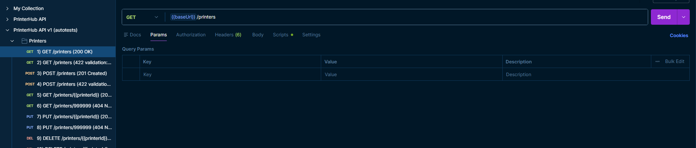

- **Скриншоты ответа:**

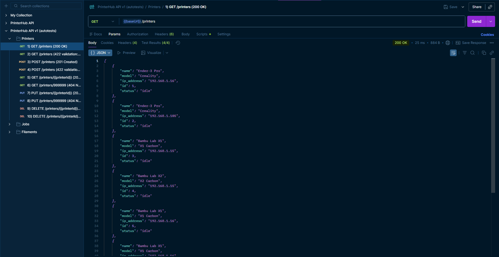

- **Код автотеста:**

```javascript
pm.test('Status 200', function () { pm.response.to.have.status(200); });
pm.test('Response is JSON', function () { pm.response.to.be.json; });
const data = pm.response.json();
pm.test('Array', function () { pm.expect(data).to.be.an('array'); });
pm.test('Items have id', function () { if (data.length) pm.expect(data[0]).to.have.property('id'); });
```

- **Скриншот Test Results:**

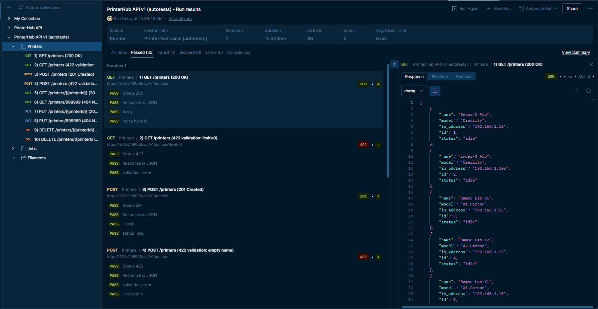

---

**Тест 2 (422)**  

- **Строка запроса:** `GET {{baseUrl}}/printers?limit=0`
- **Скриншот запроса:**

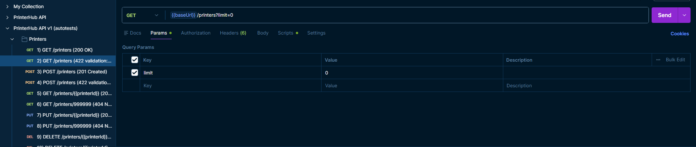

- **Скриншоты ответа:**

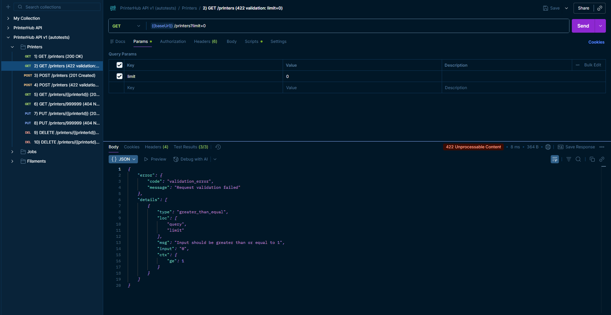

- **Код автотеста:**

```javascript
pm.test('Status 422', function () { pm.response.to.have.status(422); });
pm.test('Response is JSON', function () { pm.response.to.be.json; });
const data = pm.response.json();
pm.test('validation_error', function () { pm.expect(data.error.code).to.eql('validation_error'); });
```

- **Скриншот Test Results:**

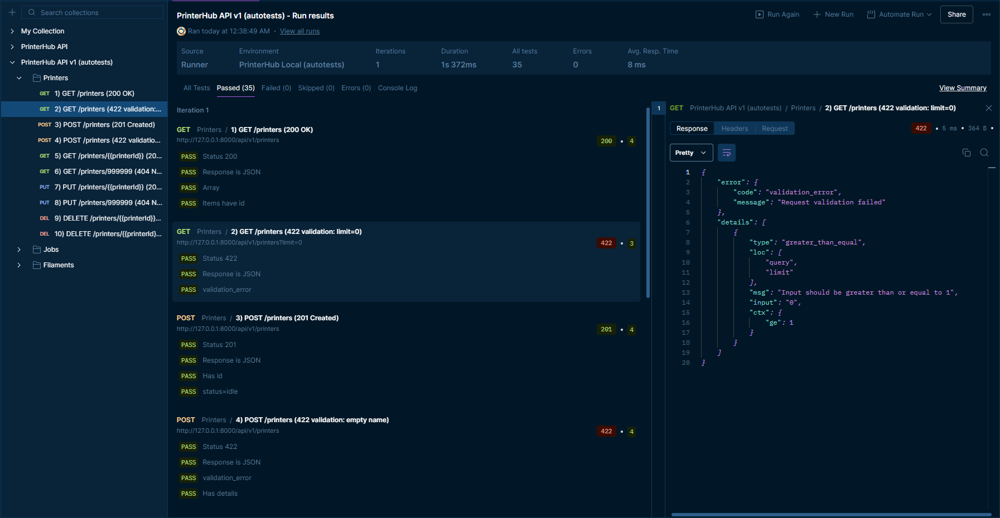

---

### **3.1.2. Регистрация нового принтера: `POST` `/api/v1/printers`**

---

**Тест 1 (201 Created)**  

- **Строка запроса:** `POST {{baseUrl}}/printers`
- **Скриншот запроса:**

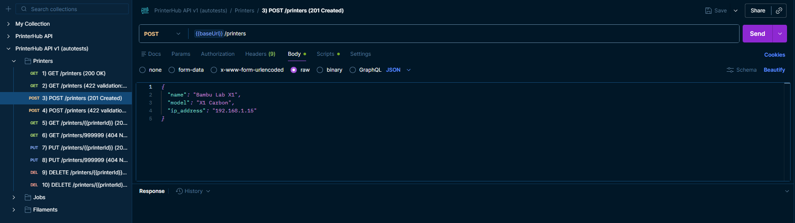

- **Скриншоты ответа:**

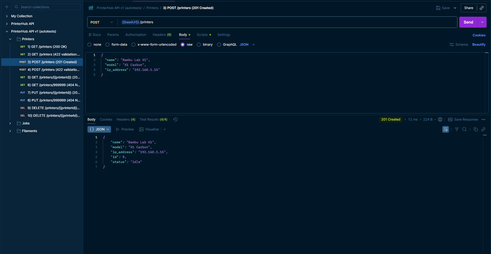

- **Код автотеста:**

```javascript
pm.test('Status 201', function () { pm.response.to.have.status(201); });
pm.test('Response is JSON', function () { pm.response.to.be.json; });
const data = pm.response.json();
pm.environment.set('printerId', data.id);
pm.test('Has id', function () { pm.expect(data).to.have.property('id'); });
pm.test('status=idle', function () { pm.expect(data.status).to.eql('idle'); });
```

- **Скриншот Test Results:**

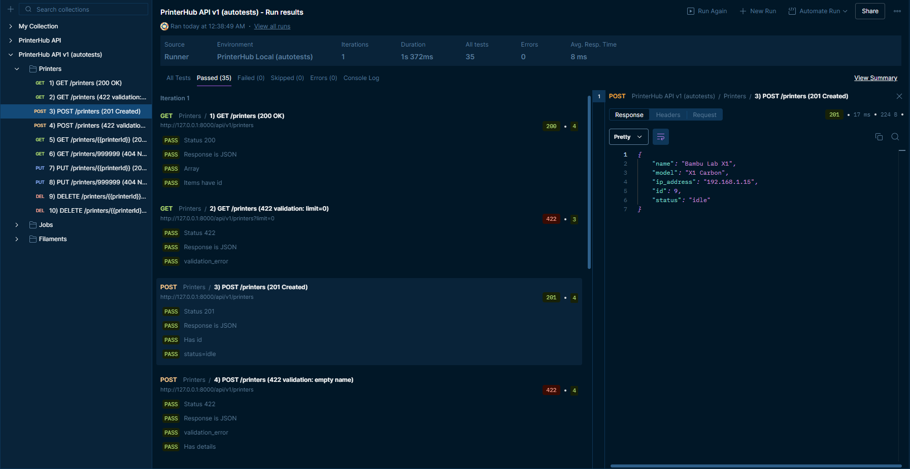

---

**Тест 2 (422)**  

- **Строка запроса:** `POST {{baseUrl}}/printers`
- **Скриншот запроса:**

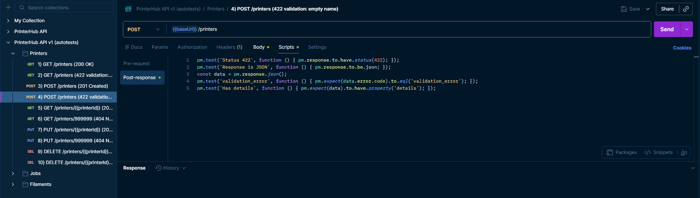

- **Скриншоты ответа:**

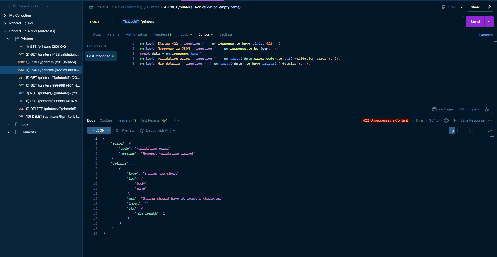

- **Код автотеста:**

```javascript
pm.test('Status 422', function () { pm.response.to.have.status(422); });
pm.test('Response is JSON', function () { pm.response.to.be.json; });
const data = pm.response.json();
pm.test('validation_error', function () { pm.expect(data.error.code).to.eql('validation_error'); });
pm.test('Has details', function () { pm.expect(data).to.have.property('details'); });
```

- **Скриншот Test Results:**

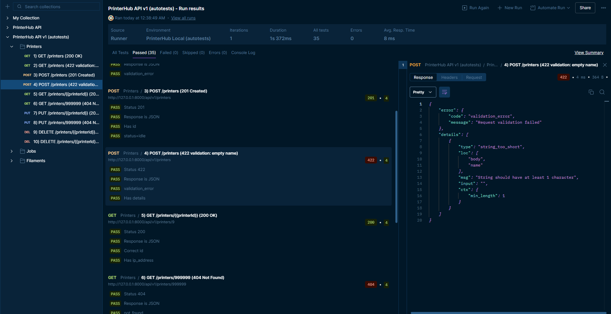

---

### **3.1.3. Получение детальной информации о принтере: `GET` `/api/v1/printers/{printer_id}`**

---

**Тест 1 (200 OK)**  

- **Строка запроса:** `GET {{baseUrl}}/printers/{{printerId}}`
- **Скриншот запроса:**

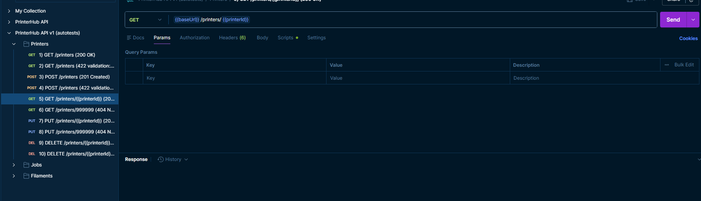

- **Скриншоты ответа:**

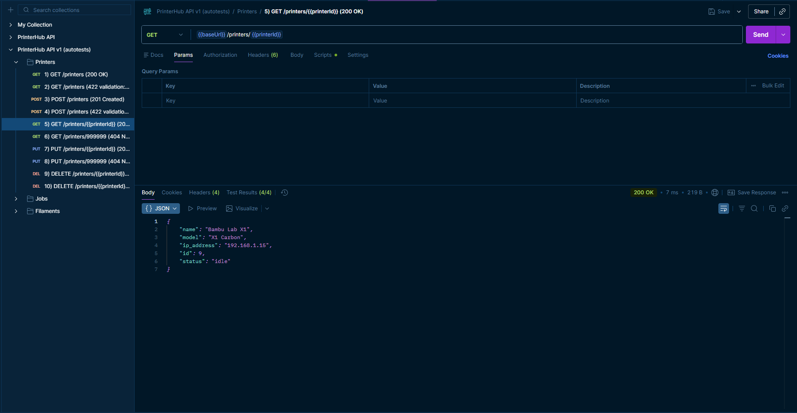

- **Код автотеста:**

```javascript
pm.test('Status 200', function () { pm.response.to.have.status(200); });
pm.test('Response is JSON', function () { pm.response.to.be.json; });
const data = pm.response.json();
pm.test('Correct id', function () { pm.expect(String(data.id)).to.eql(String(pm.environment.get('printerId'))); });
pm.test('Has ip_address', function () { pm.expect(data).to.have.property('ip_address'); });
```

- **Скриншот Test Results:**

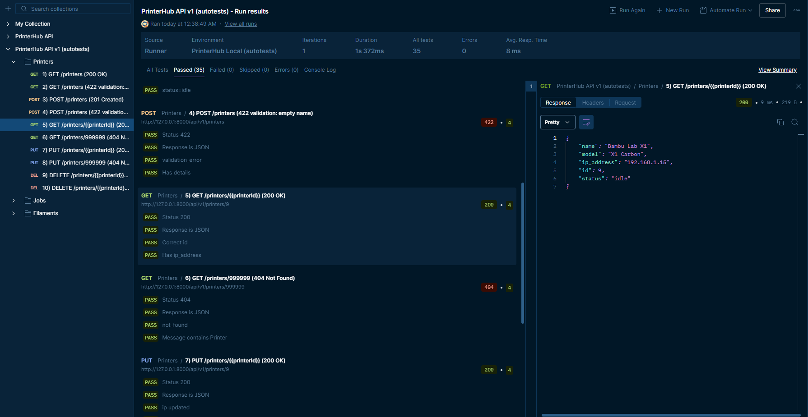

---

**Тест 2 (404 Not Found)**  

- **Строка запроса:** `GET {{baseUrl}}/printers/999999`
- **Скриншот запроса:**

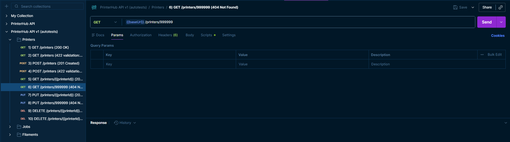

- **Скриншоты ответа:**

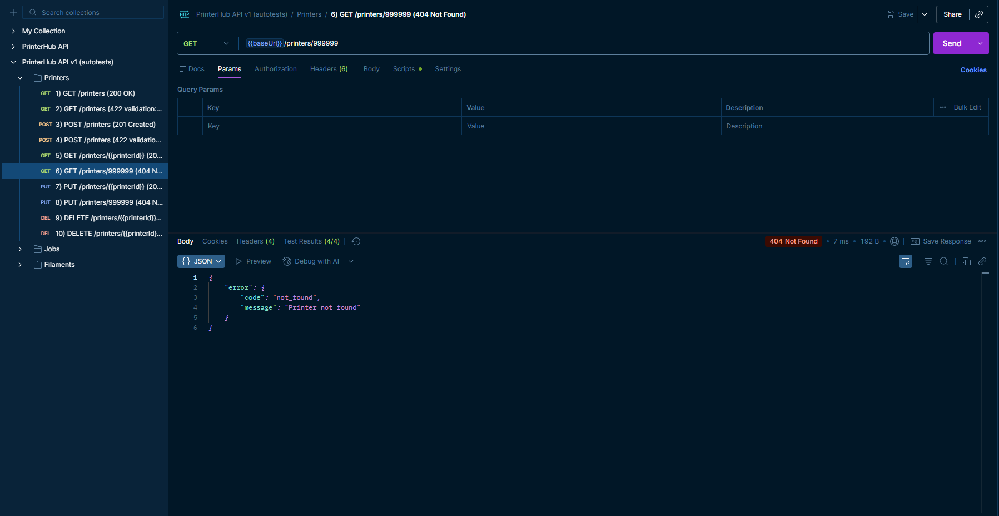

- **Код автотеста:**

```javascript
pm.test('Status 404', function () { pm.response.to.have.status(404); });
pm.test('Response is JSON', function () { pm.response.to.be.json; });
const data = pm.response.json();
pm.test('not_found', function () { pm.expect(data.error.code).to.eql('not_found'); });
pm.test('Message contains Printer', function () { pm.expect(data.error.message).to.include('Printer'); });
```

- **Скриншот Test Results:**

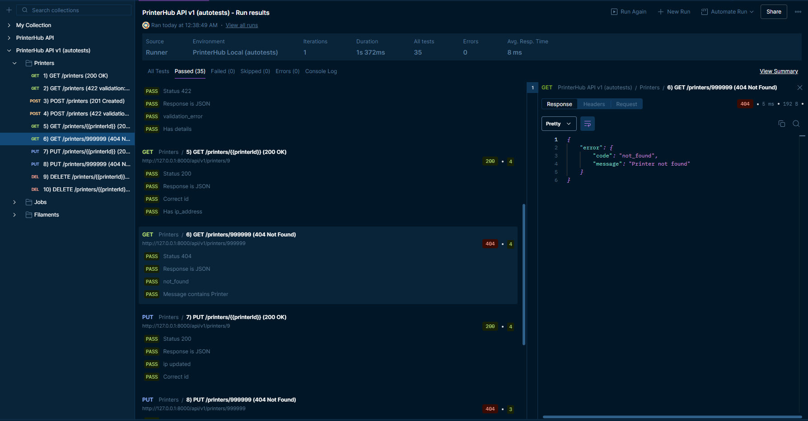

---

### **3.1.4. Обновление информации о принтере: `PUT` `/api/v1/printers/{printer_id}`**

---

**Тест 1 (200 OK)**  

- **Строка запроса:** `PUT {{baseUrl}}/printers/{{printerId}}`
- **Скриншот запроса:**

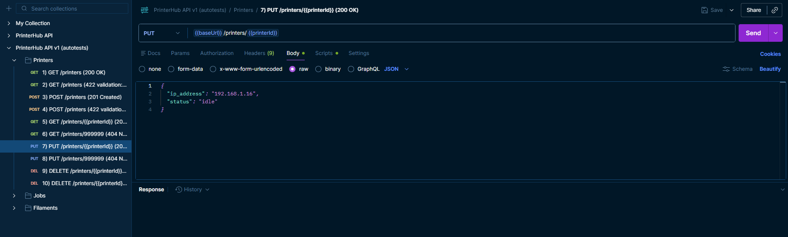

- **Скриншоты ответа:**

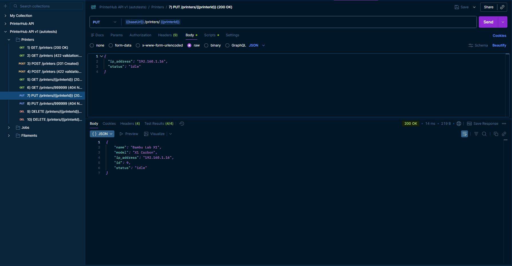

- **Код автотеста:**

```javascript
pm.test('Status 200', function () { pm.response.to.have.status(200); });
pm.test('Response is JSON', function () { pm.response.to.be.json; });
const data = pm.response.json();
pm.test('ip updated', function () { pm.expect(data.ip_address).to.eql('192.168.1.16'); });
pm.test('Correct id', function () { pm.expect(String(data.id)).to.eql(String(pm.environment.get('printerId'))); });
```

- **Скриншот Test Results:**

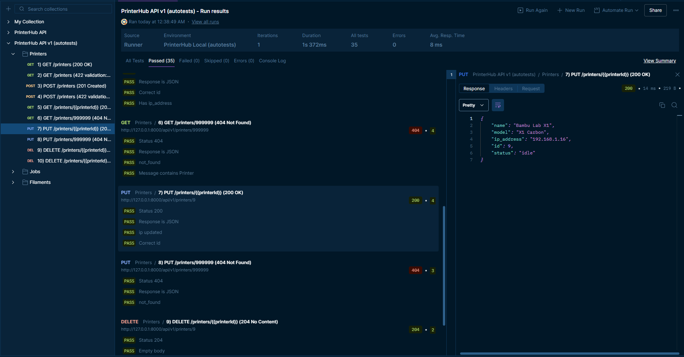

---

**Тест 2 (404 Not Found)**  

- **Строка запроса:** `PUT {{baseUrl}}/printers/999999`
- **Скриншот запроса:**

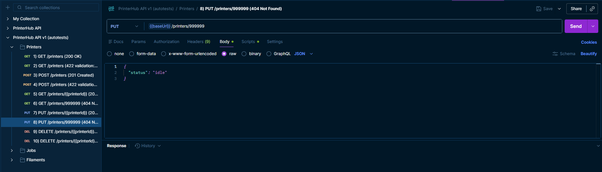

- **Скриншоты ответа:**

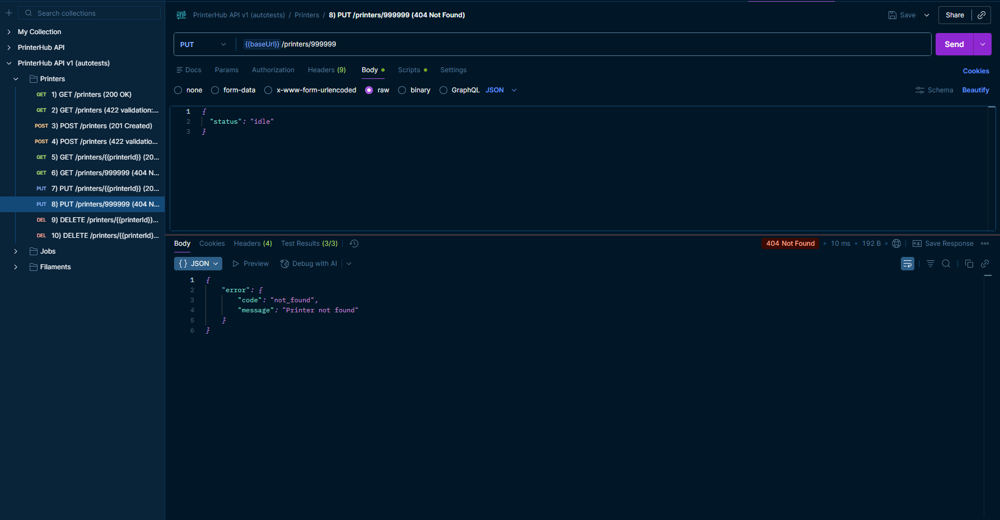

- **Код автотеста:**

```javascript
pm.test('Status 404', function () { pm.response.to.have.status(404); });
pm.test('Response is JSON', function () { pm.response.to.be.json; });
const data = pm.response.json();
pm.test('not_found', function () { pm.expect(data.error.code).to.eql('not_found'); });
```

- **Скриншот Test Results:**

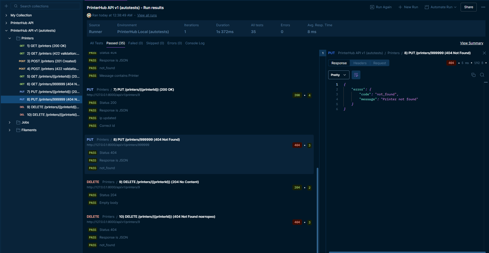

---

### **3.1.5. Удаление принтера: `DELETE` `/api/v1/printers/{printer_id}`**

---

**Тест 1 (204 No Content)**  

- **Строка запроса:** `DELETE {{baseUrl}}/printers/{{printerId}}`
- **Скриншот запроса:**

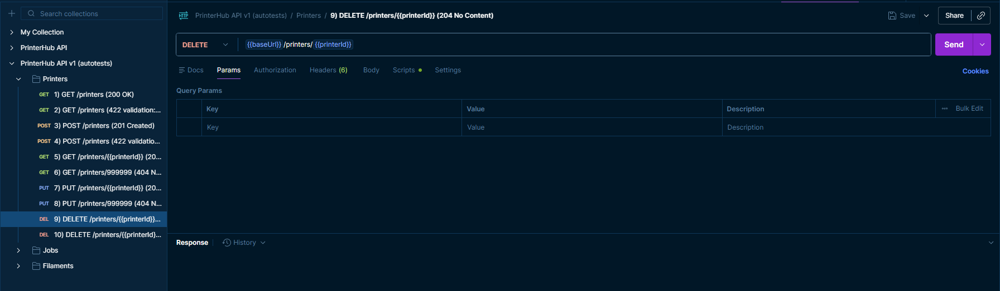

- **Скриншоты ответа:**

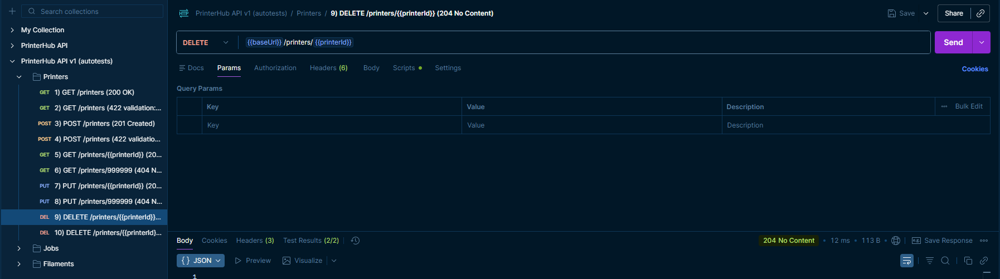

- **Код автотеста:**

```javascript
pm.test('Status 204', function () { pm.response.to.have.status(204); });
pm.test('Empty body', function () { pm.expect(pm.response.text()).to.eql(''); });
```

- **Скриншот Test Results:**

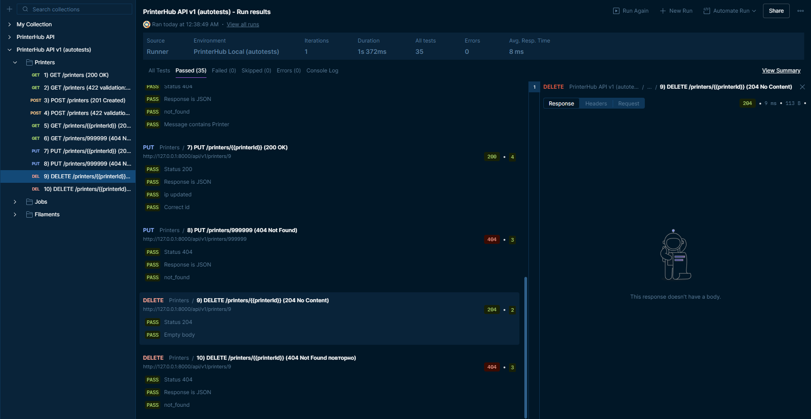

---

**Тест 2 (404 Not Found)**  

- **Строка запроса:** `DELETE {{baseUrl}}/printers/{{printerId}}`
- **Скриншот запроса:**

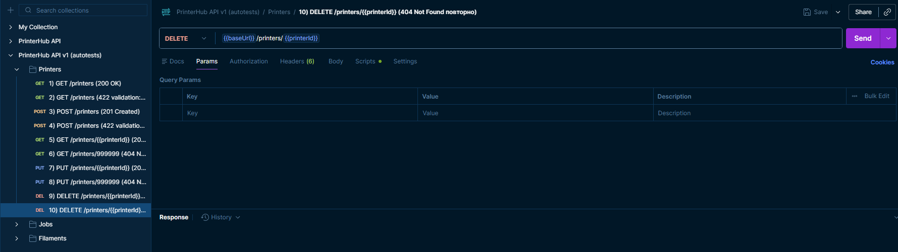

- **Скриншоты ответа:**

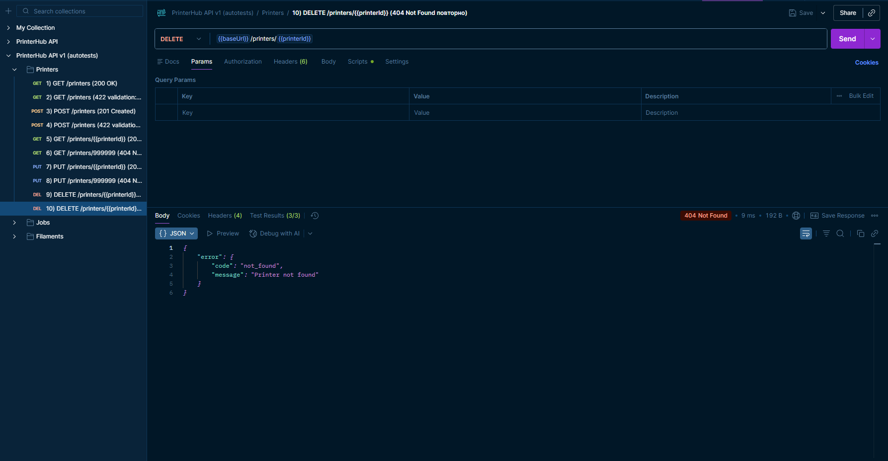

- **Код автотеста:**

```javascript
pm.test('Status 404', function () { pm.response.to.have.status(404); });
pm.test('Response is JSON', function () { pm.response.to.be.json; });
const data = pm.response.json();
pm.test('not_found', function () { pm.expect(data.error.code).to.eql('not_found'); });
```

- **Скриншот Test Results:**

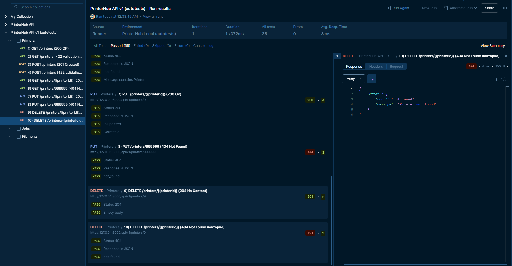

---

## **3.2. Ресурс: Задания печати (`/api/v1/jobs`)**

### **3.2.1. Получение списка заданий на печать: `GET` `/api/v1/jobs`**

---

**Тест 1 (200 OK)**  

- **Строка запроса:** `GET {{baseUrl}}/jobs`
- **Скриншот запроса:**

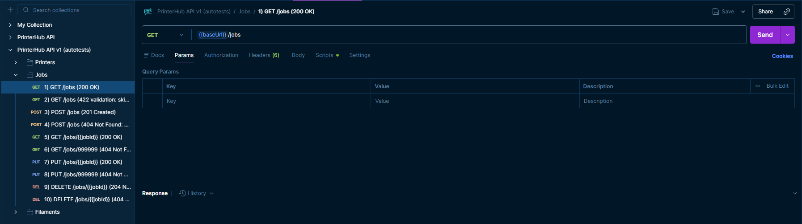

- **Скриншоты ответа:**

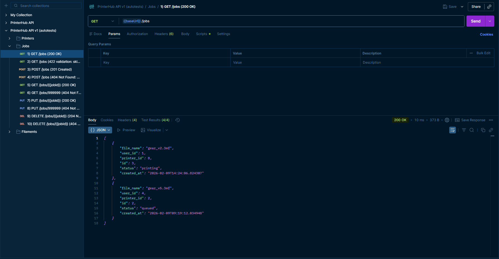

- **Код автотеста:**

```javascript
pm.test('Status 200', function () { pm.response.to.have.status(200); });
pm.test('Response is JSON', function () { pm.response.to.be.json; });
const data = pm.response.json();
pm.test('Array', function () { pm.expect(data).to.be.an('array'); });
pm.test('Items have id', function () { if (data.length) pm.expect(data[0]).to.have.property('id'); });
```

- **Скриншот Test Results:**

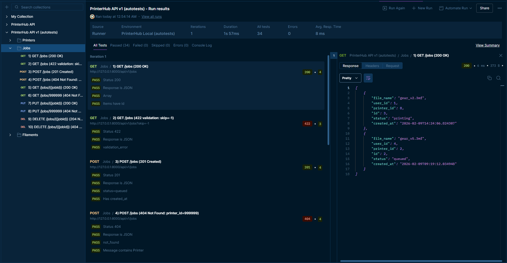

---

**Тест 2 (422)**  

- **Строка запроса:** `GET {{baseUrl}}/jobs?skip=-1`
- **Скриншот запроса:**

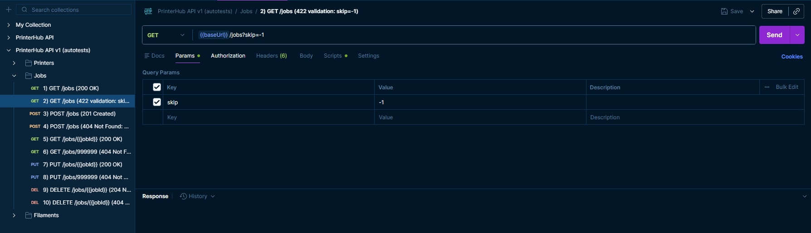

- **Скриншоты ответа:**

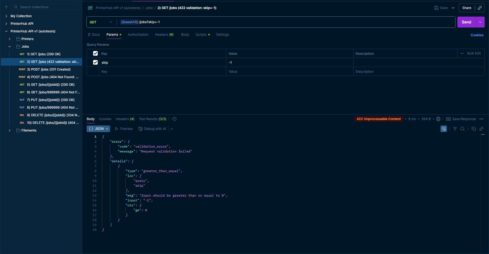

- **Код автотеста:**

```javascript
pm.test('Status 422', function () { pm.response.to.have.status(422); });
pm.test('Response is JSON', function () { pm.response.to.be.json; });
const data = pm.response.json();
pm.test('validation_error', function () { pm.expect(data.error.code).to.eql('validation_error'); });
```

- **Скриншот Test Results:**

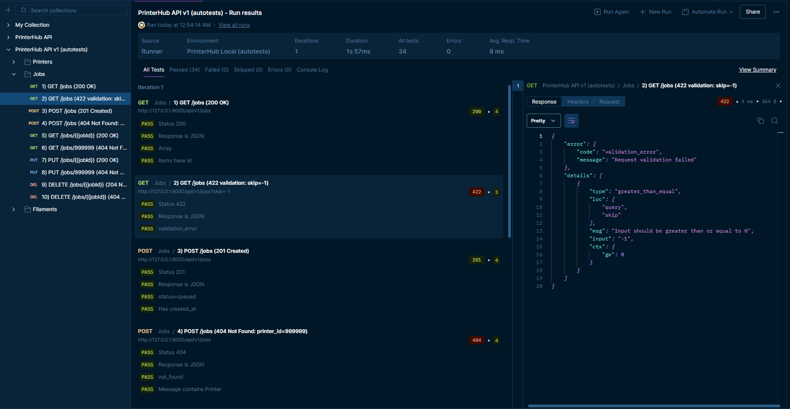

---

### **3.2.2. Создание задания на печать: `POST` `/api/v1/jobs`**

---

**Тест 1 (201 Created)**  

- **Строка запроса:** `POST {{baseUrl}}/jobs`
- **Скриншот запроса:**

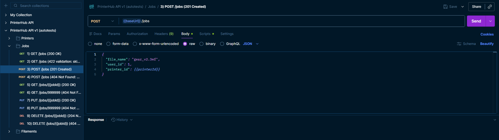

- **Скриншоты ответа:**

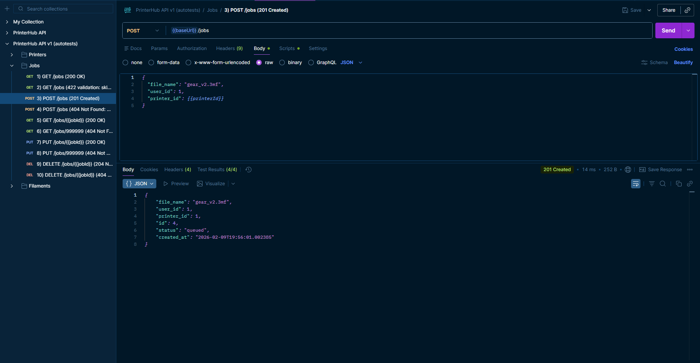

- **Код автотеста:**

```javascript
pm.test('Status 201', function () { pm.response.to.have.status(201); });
pm.test('Response is JSON', function () { pm.response.to.be.json; });
const data = pm.response.json();
pm.environment.set('jobId', data.id);
pm.test('status=queued', function () { pm.expect(data.status).to.eql('queued'); });
pm.test('Has created_at', function () { pm.expect(data).to.have.property('created_at'); });
```

- **Скриншот Test Results:**

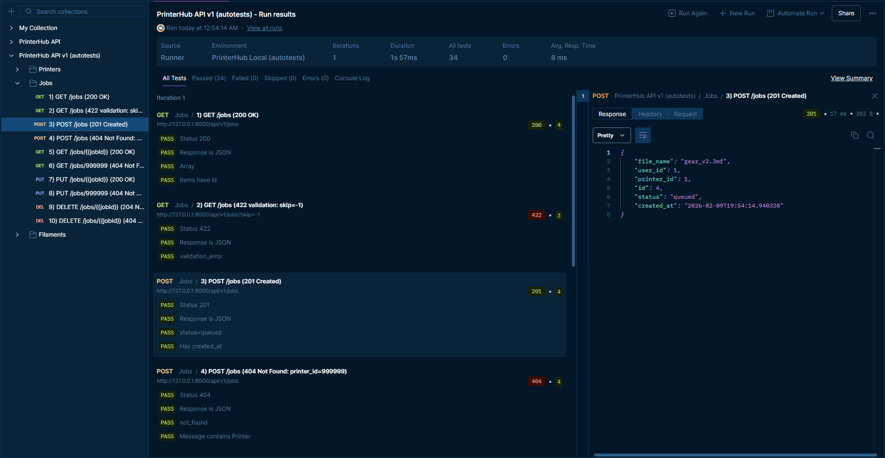

---

**Тест 2 (404)**  

- **Строка запроса:** `POST {{baseUrl}}/jobs`
- **Скриншот запроса:**

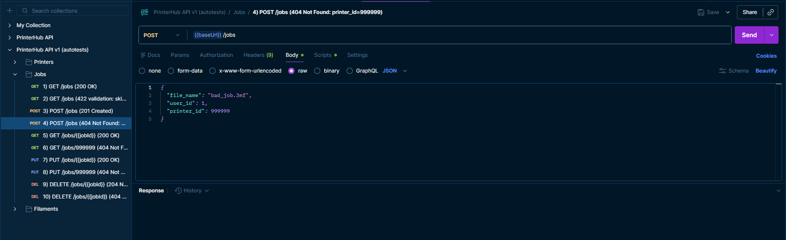

- **Скриншоты ответа:**

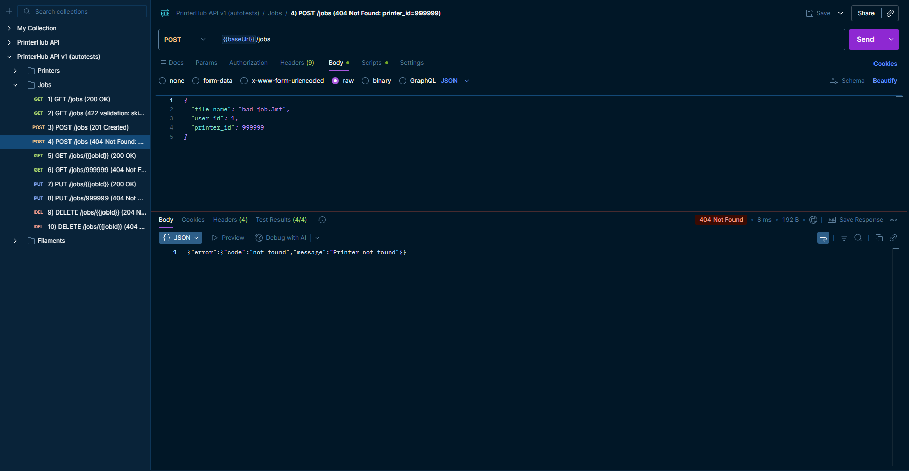

- **Код автотеста:**

```javascript
pm.test('Status 404', function () { pm.response.to.have.status(404); });
pm.test('Response is JSON', function () { pm.response.to.be.json; });
const data = pm.response.json();
pm.test('not_found', function () { pm.expect(data.error.code).to.eql('not_found'); });
pm.test('Message contains Printer', function () { pm.expect(data.error.message).to.include('Printer'); });
```

- **Скриншот Test Results:**

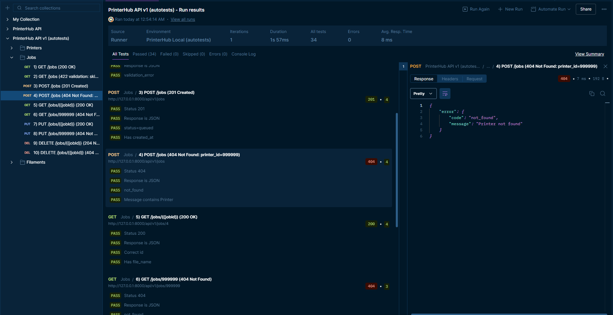

---

### **3.2.3. Получение детальной информации о задании на печать: `GET` `/api/v1/jobs/{job_id}`**

---

**Тест 1 (200 OK)**  

- **Строка запроса:** `GET {{baseUrl}}/jobs/{{jobId}}`
- **Скриншот запроса:**

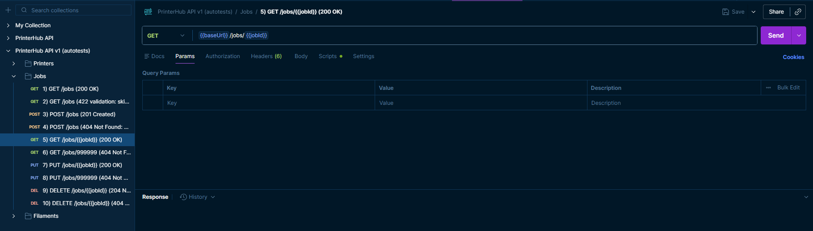

- **Скриншоты ответа:**

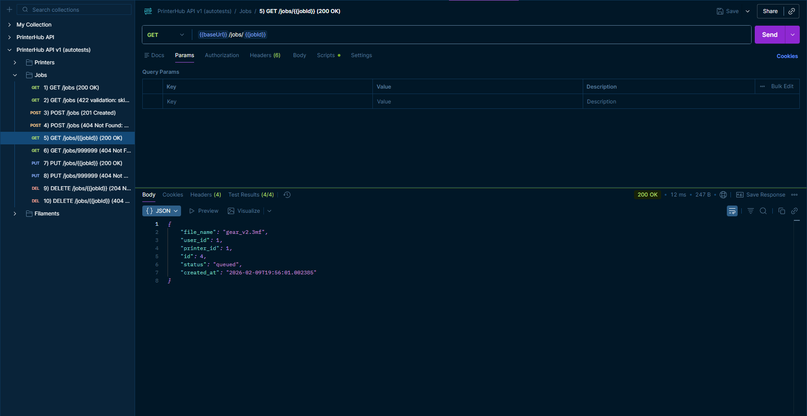

- **Код автотеста:**

```javascript
pm.test('Status 200', function () { pm.response.to.have.status(200); });
pm.test('Response is JSON', function () { pm.response.to.be.json; });
const data = pm.response.json();
pm.test('Correct id', function () { pm.expect(String(data.id)).to.eql(String(pm.environment.get('jobId'))); });
pm.test('Has file_name', function () { pm.expect(data).to.have.property('file_name'); });
```

- **Скриншот Test Results:**

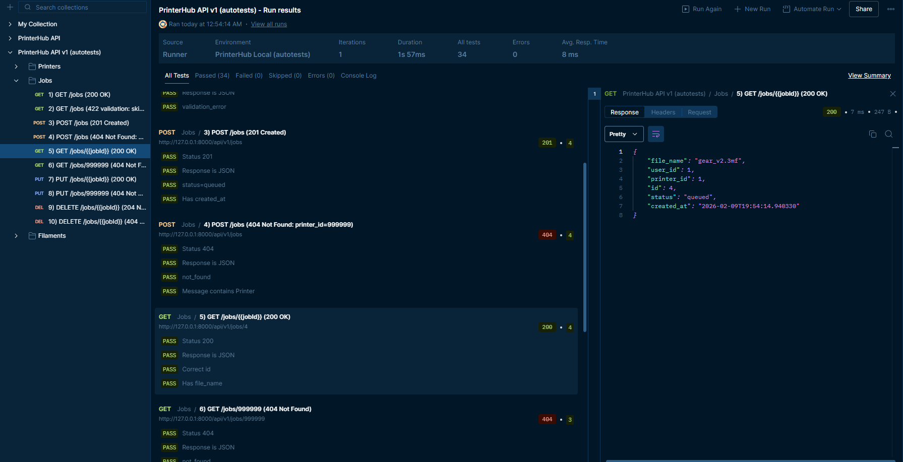

---

**Тест 2 (404)**  

- **Строка запроса:** `GET {{baseUrl}}/jobs/999999`
- **Скриншот запроса:**

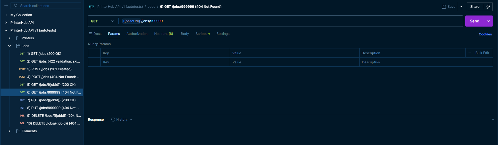

- **Скриншоты ответа:**

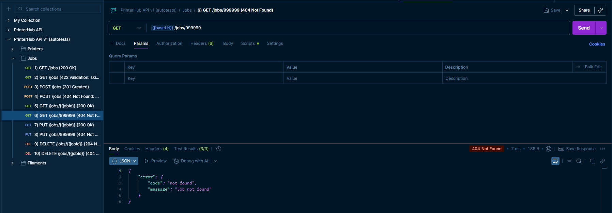

- **Код автотеста:**

```javascript
pm.test('Status 404', function () { pm.response.to.have.status(404); });
pm.test('Response is JSON', function () { pm.response.to.be.json; });
const data = pm.response.json();
pm.test('not_found', function () { pm.expect(data.error.code).to.eql('not_found'); });
```

- **Скриншот Test Results:**

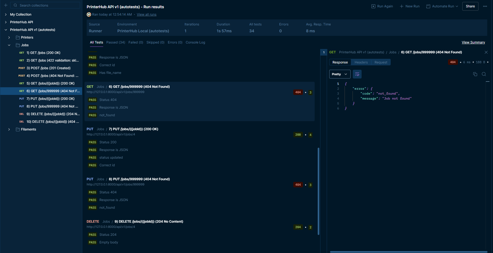

---

### **3.2.4. Обновление информации о задании на печать: `PUT` `/api/v1/jobs/{job_id}`**

---

**Тест 1 (200 OK)**  

- **Строка запроса:** `PUT {{baseUrl}}/jobs/{{jobId}}`
- **Скриншот запроса:**

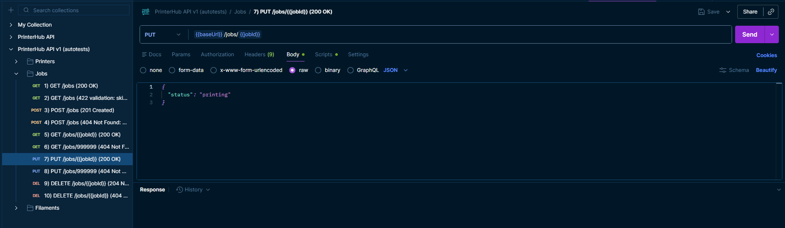

- **Скриншоты ответа:**

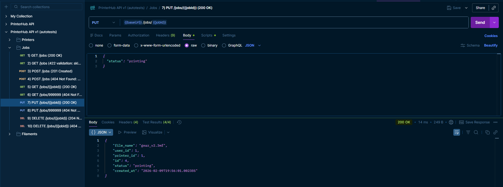

- **Код автотеста:**

```javascript
pm.test('Status 200', function () { pm.response.to.have.status(200); });
pm.test('Response is JSON', function () { pm.response.to.be.json; });
const data = pm.response.json();
pm.test('status updated', function () { pm.expect(data.status).to.eql('printing'); });
pm.test('Correct id', function () { pm.expect(String(data.id)).to.eql(String(pm.environment.get('jobId'))); });
```

- **Скриншот Test Results:**

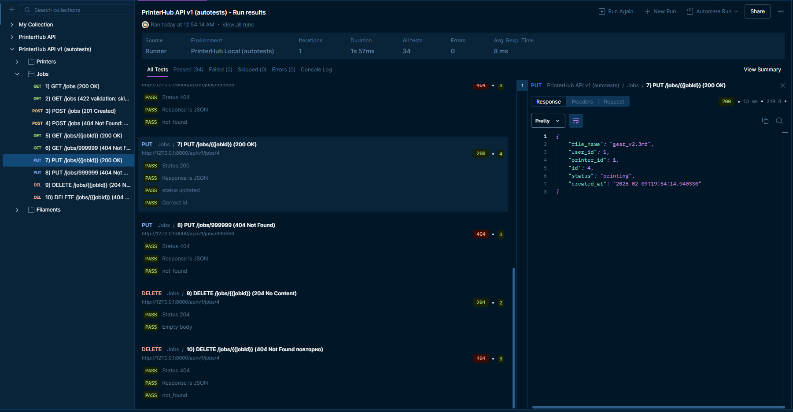

---

**Тест 2 (404)**  

- **Строка запроса:** `PUT {{baseUrl}}/jobs/999999`
- **Скриншот запроса:**

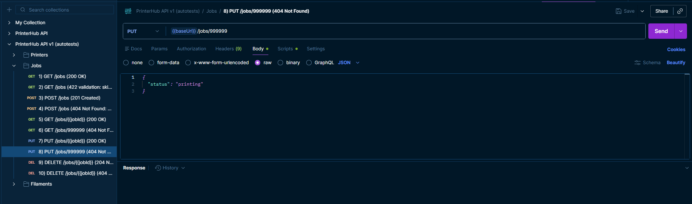

- **Скриншоты ответа:**

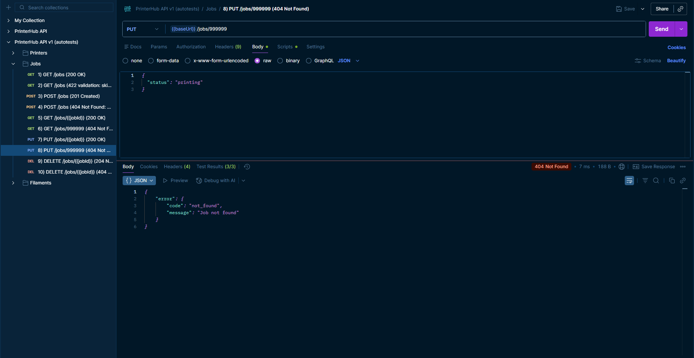

- **Код автотеста:**

```javascript
pm.test('Status 404', function () { pm.response.to.have.status(404); });
pm.test('Response is JSON', function () { pm.response.to.be.json; });
const data = pm.response.json();
pm.test('not_found', function () { pm.expect(data.error.code).to.eql('not_found'); });
```

- **Скриншот Test Results:**

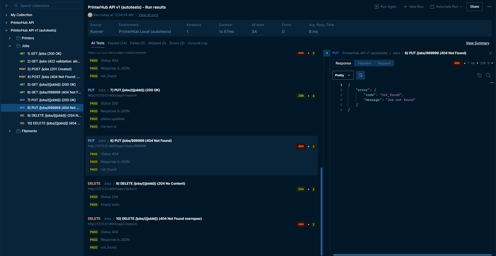

---

### **3.2.5. Удаление задания на печать: `DELETE`  `/api/v1/jobs/{job_id}`**

---

**Тест 1 (204)**  

- **Строка запроса:** `DELETE {{baseUrl}}/jobs/{{jobId}}`
- **Скриншот запроса:**

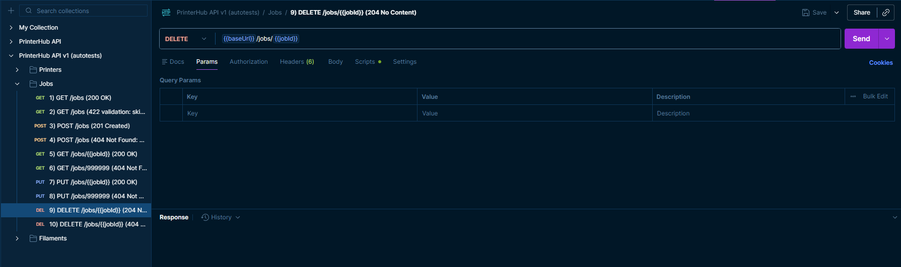

- **Скриншоты ответа:**

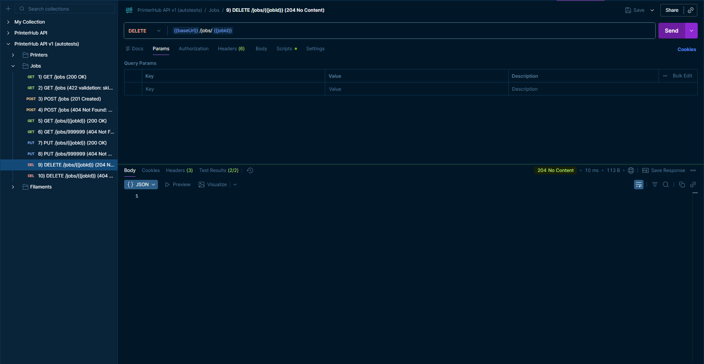

- **Код автотеста:**

```javascript
pm.test('Status 204', function () { pm.response.to.have.status(204); });
pm.test('Empty body', function () { pm.expect(pm.response.text()).to.eql(''); });
```

- **Скриншот Test Results:**

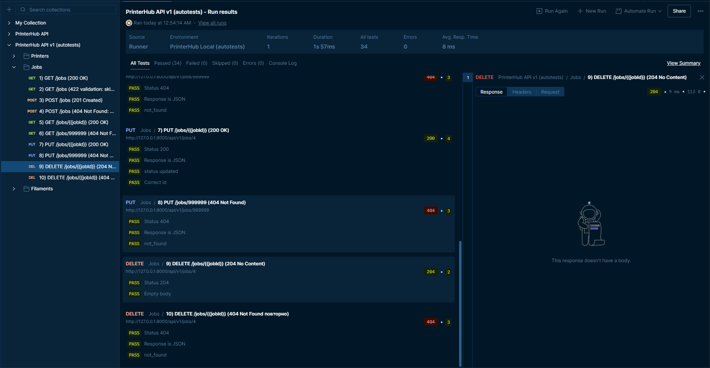

---

**Тест 2 (404)**  

- **Строка запроса:** `DELETE {{baseUrl}}/jobs/{{jobId}}`
- **Скриншот запроса:**

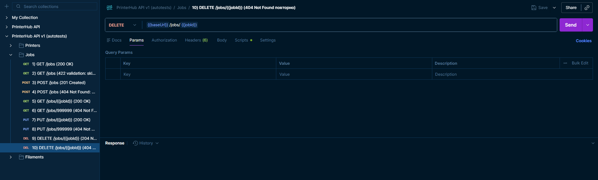

- **Скриншоты ответа:**

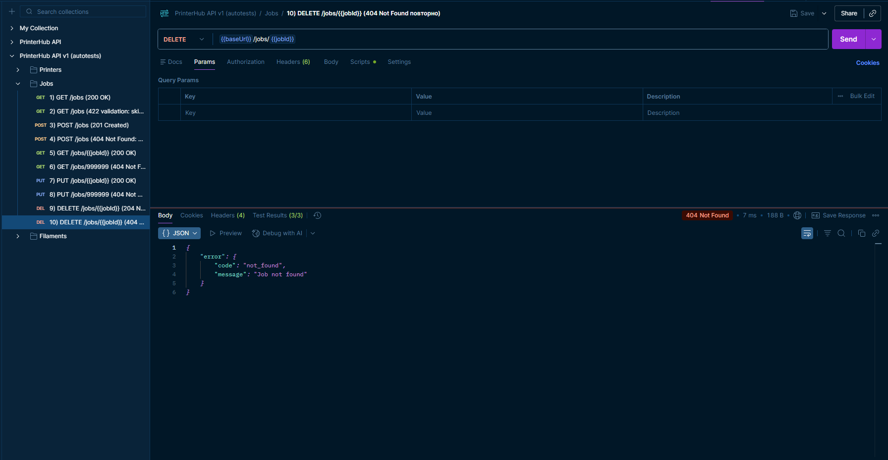

- **Код автотеста:**

```javascript
pm.test('Status 404', function () { pm.response.to.have.status(404); });
pm.test('Response is JSON', function () { pm.response.to.be.json; });
const data = pm.response.json();
pm.test('not_found', function () { pm.expect(data.error.code).to.eql('not_found'); });
```

- **Скриншот Test Results:**

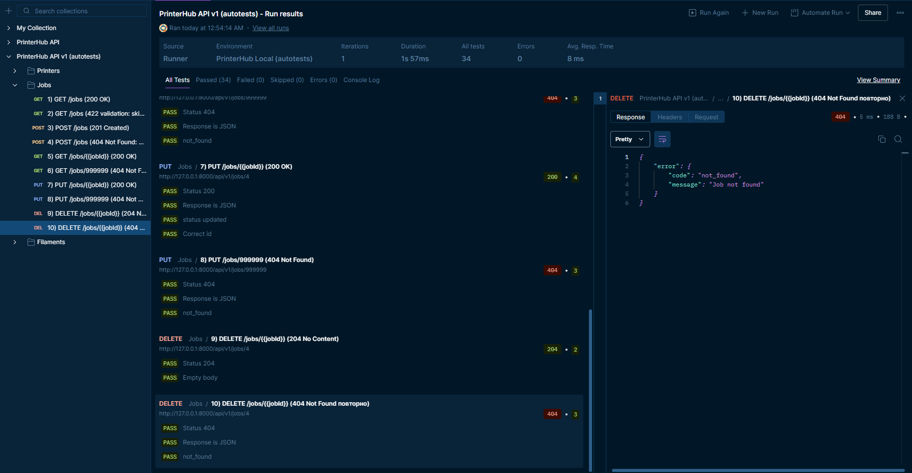

---

## **3.3. Ресурс: Материалы (`/api/v1/filaments`)**

### **3.3.1. Получение списка пластика `GET` `/api/v1/filaments`**

---

**Тест 1 (200 OK)**  

- **Строка запроса:** `GET {{baseUrl}}/filaments`
- **Скриншот запроса:**

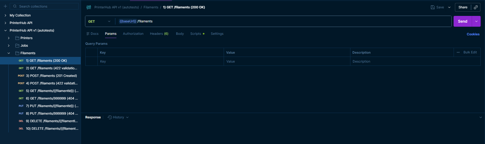

- **Скриншоты ответа:**

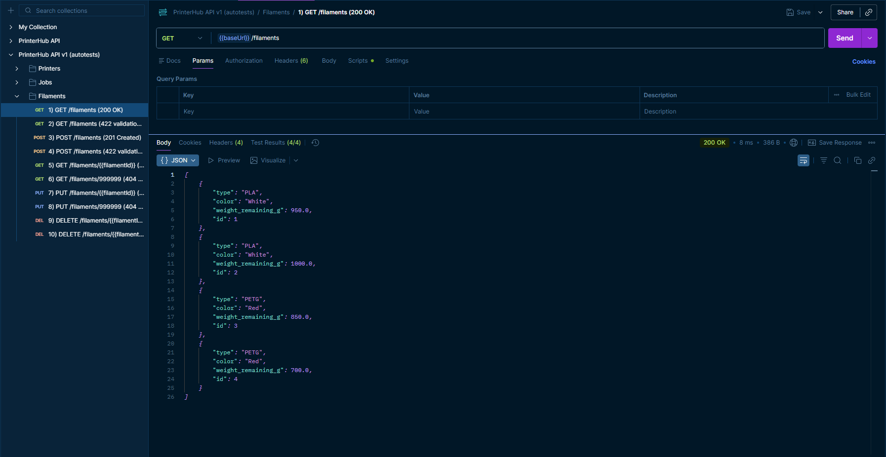

- **Код автотеста:**

```javascript
pm.test('Status 200', function () { pm.response.to.have.status(200); });
pm.test('Response is JSON', function () { pm.response.to.be.json; });
const data = pm.response.json();
pm.test('Array', function () { pm.expect(data).to.be.an('array'); });
pm.test('Items have id', function () { if (data.length) pm.expect(data[0]).to.have.property('id'); });
```

- **Скриншот Test Results:**

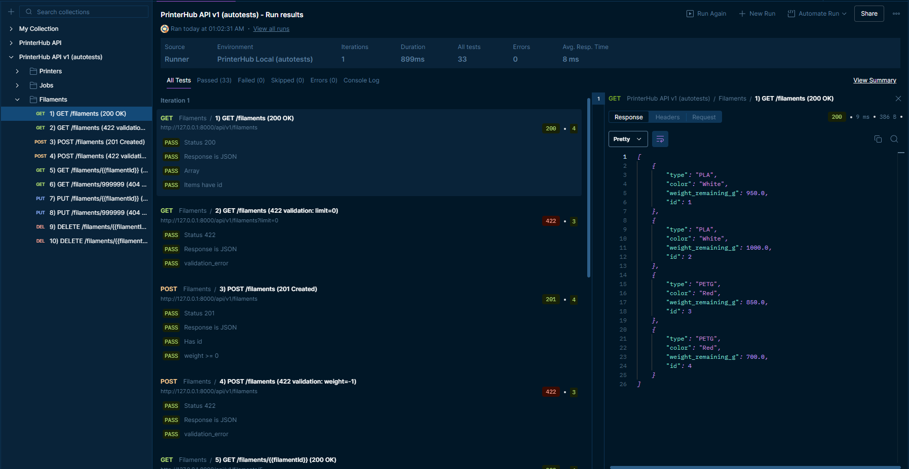

---

**Тест 2 (422)**  

- **Строка запроса:** `GET {{baseUrl}}/filaments?limit=0`
- **Скриншот запроса:**

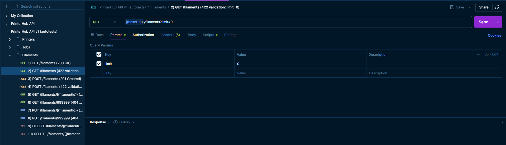

- **Скриншоты ответа:**

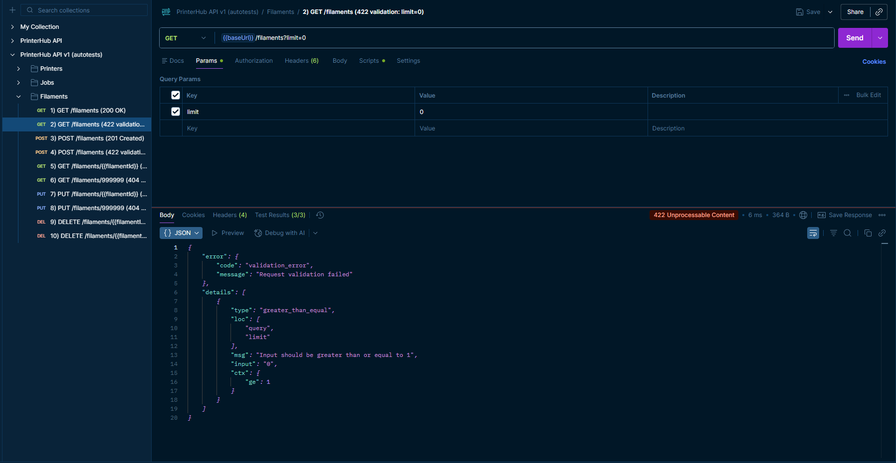

- **Код автотеста:**

```javascript
pm.test('Status 422', function () { pm.response.to.have.status(422); });
pm.test('Response is JSON', function () { pm.response.to.be.json; });
const data = pm.response.json();
pm.test('validation_error', function () { pm.expect(data.error.code).to.eql('validation_error'); });
```

- **Скриншот Test Results:**

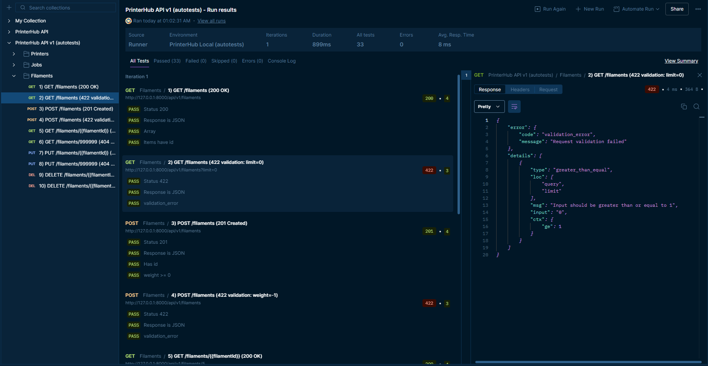

---

### **3.3.2. Регистрация нового пластика: `POST` `/api/v1/filaments`**

---

**Тест 1 (201 Created)**  

- **Строка запроса:** `POST {{baseUrl}}/filaments`
- **Скриншот запроса:**

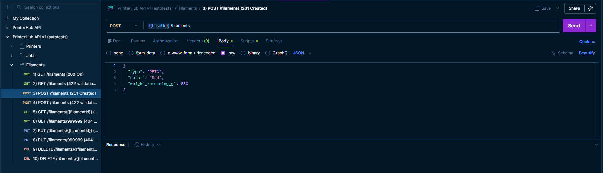

- **Скриншоты ответа:**

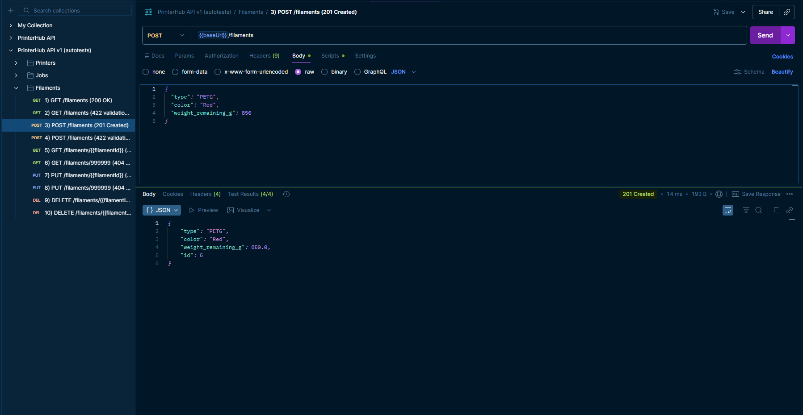

- **Код автотеста:**

```javascript
pm.test('Status 201', function () { pm.response.to.have.status(201); });
pm.test('Response is JSON', function () { pm.response.to.be.json; });
const data = pm.response.json();
pm.environment.set('filamentId', data.id);
pm.test('Has id', function () { pm.expect(data).to.have.property('id'); });
pm.test('weight >= 0', function () { pm.expect(data.weight_remaining_g).to.be.at.least(0); });
```

- **Скриншот Test Results:**

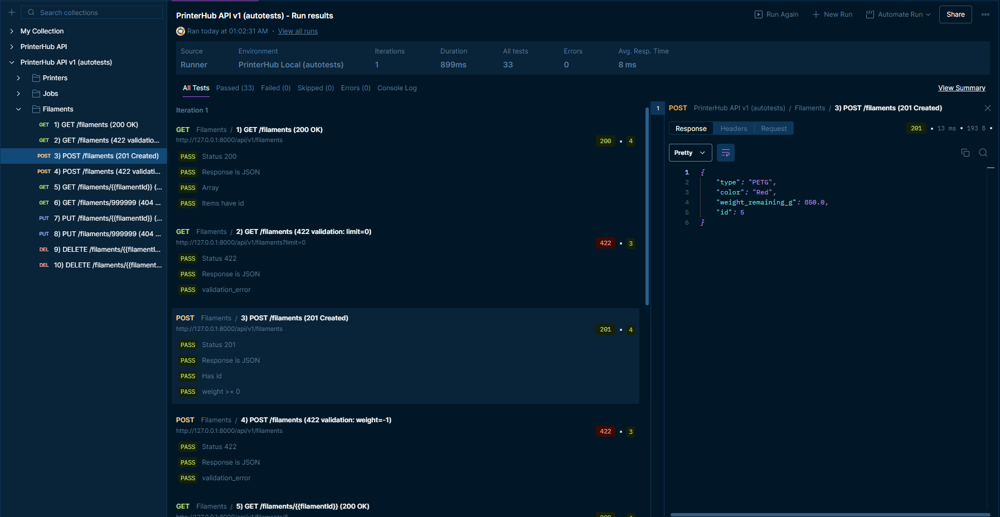

---

**Тест 2 (404)**  

- **Строка запроса:** `POST {{baseUrl}}/filaments`
- **Скриншот запроса:**

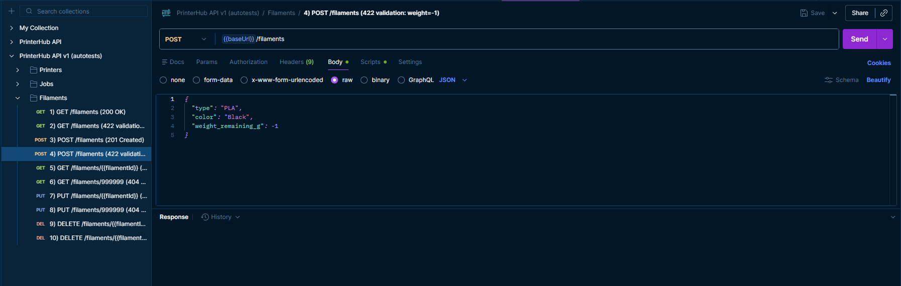

- **Скриншоты ответа:**

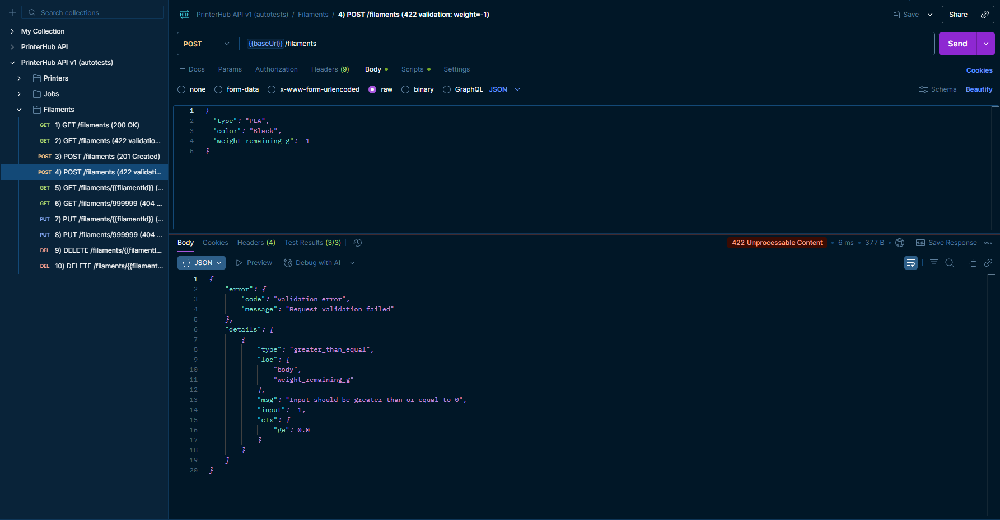

- **Код автотеста:**

```javascript
pm.test('Status 422', function () { pm.response.to.have.status(422); });
pm.test('Response is JSON', function () { pm.response.to.be.json; });
const data = pm.response.json();
pm.test('validation_error', function () { pm.expect(data.error.code).to.eql('validation_error'); });
```

- **Скриншот Test Results:**

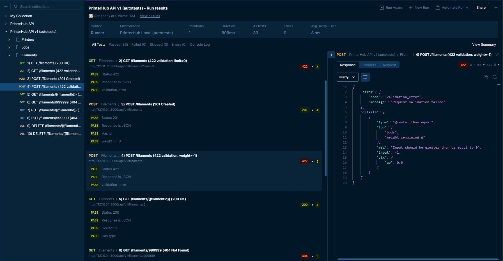

---

### **3.3.3. Получение детальной информации о пластике: `GET` `/api/v1/filaments/{filament_id}`**

---

**Тест 1 (200 OK)**  

- **Строка запроса:** `GET {{baseUrl}}/filaments/{{filamentId}}`
- **Скриншот запроса:**

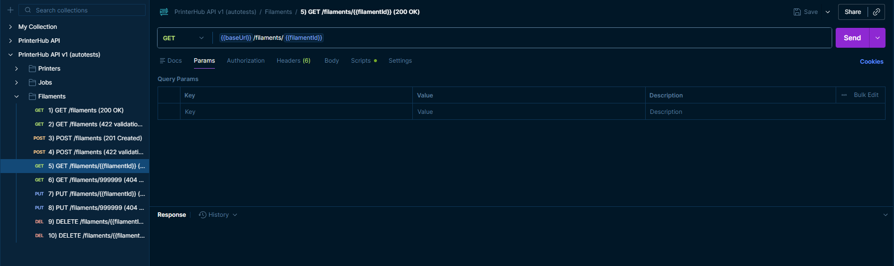

- **Скриншоты ответа:**

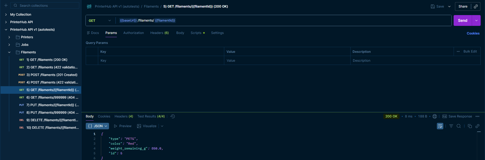

- **Код автотеста:**

```javascript
pm.test('Status 200', function () { pm.response.to.have.status(200); });
pm.test('Response is JSON', function () { pm.response.to.be.json; });
const data = pm.response.json();
pm.test('Correct id', function () { pm.expect(String(data.id)).to.eql(String(pm.environment.get('filamentId'))); });
pm.test('Has type', function () { pm.expect(data).to.have.property('type'); });
```

- **Скриншот Test Results:**

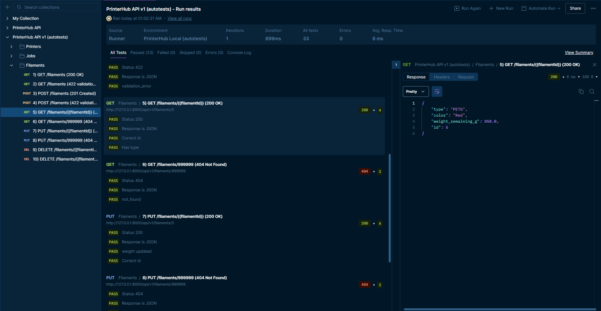

---

**Тест 2 (404)**  

- **Строка запроса:** `GET {{baseUrl}}/filaments/999999`
- **Скриншот запроса:**

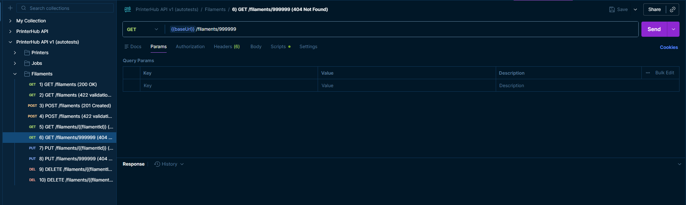

- **Скриншоты ответа:**

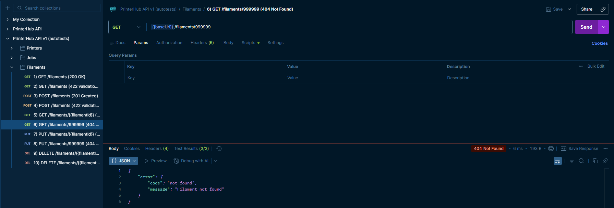

- **Код автотеста:**

```javascript
pm.test('Status 404', function () { pm.response.to.have.status(404); });
pm.test('Response is JSON', function () { pm.response.to.be.json; });
const data = pm.response.json();
pm.test('not_found', function () { pm.expect(data.error.code).to.eql('not_found'); });
```

- **Скриншот Test Results:**

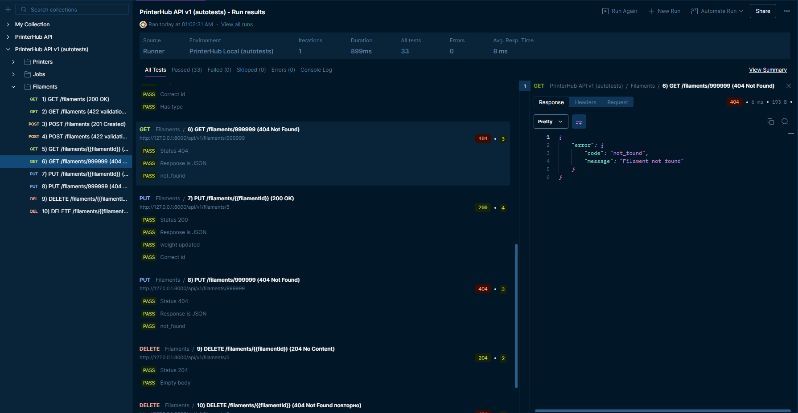

---

### **3.3.4. Обновление информации о пластике (Вес/Цвет): `PUT` `/api/v1/filaments/{filament_id}`**

---

**Тест 1 (200 OK)**  

- **Строка запроса:** `PUT {{baseUrl}}/filaments/{{filamentId}}`
- **Скриншот запроса:**

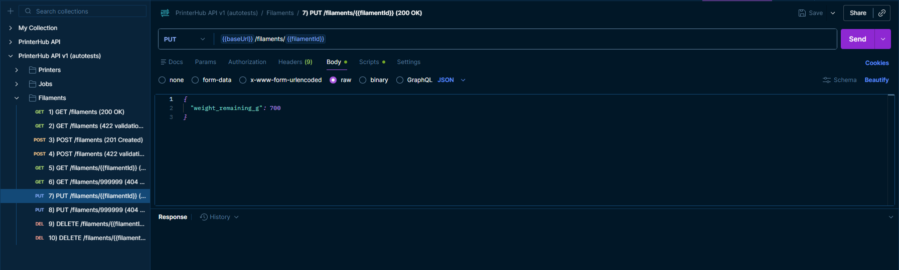

- **Скриншоты ответа:**

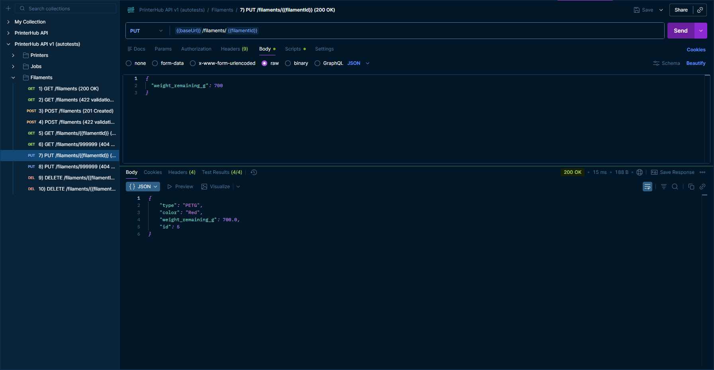

- **Код автотеста:**

```javascript
pm.test('Status 200', function () { pm.response.to.have.status(200); });
pm.test('Response is JSON', function () { pm.response.to.be.json; });
const data = pm.response.json();
pm.test('weight updated', function () { pm.expect(data.weight_remaining_g).to.eql(700); });
pm.test('Correct id', function () { pm.expect(String(data.id)).to.eql(String(pm.environment.get('filamentId'))); });
```

- **Скриншот Test Results:**

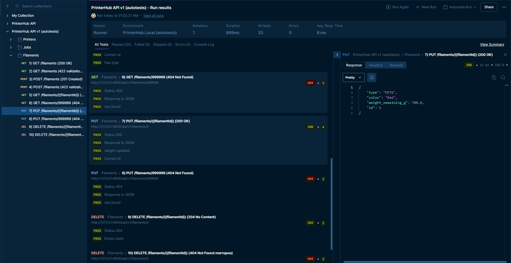

---

**Тест 2 (404)**  

- **Строка запроса:** `PUT {{baseUrl}}/filaments/999999`
- **Скриншот запроса:**

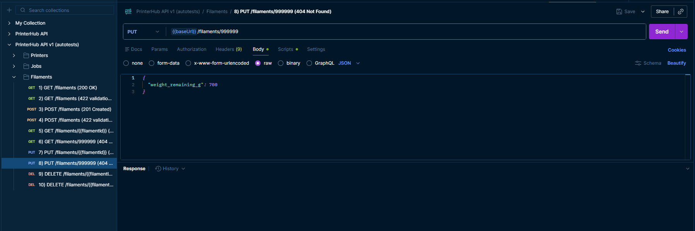

- **Скриншоты ответа:**

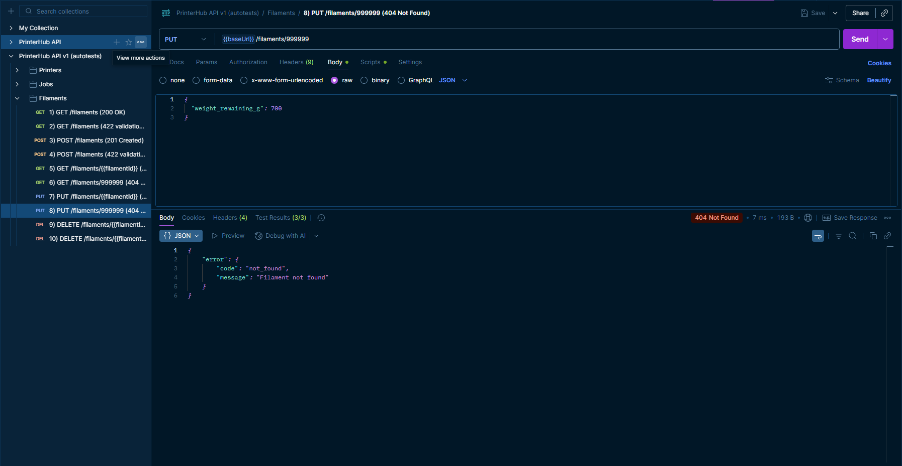

- **Код автотеста:**

```javascript
pm.test('Status 404', function () { pm.response.to.have.status(404); });
pm.test('Response is JSON', function () { pm.response.to.be.json; });
const data = pm.response.json();
pm.test('not_found', function () { pm.expect(data.error.code).to.eql('not_found'); });
```

- **Скриншот Test Results:**

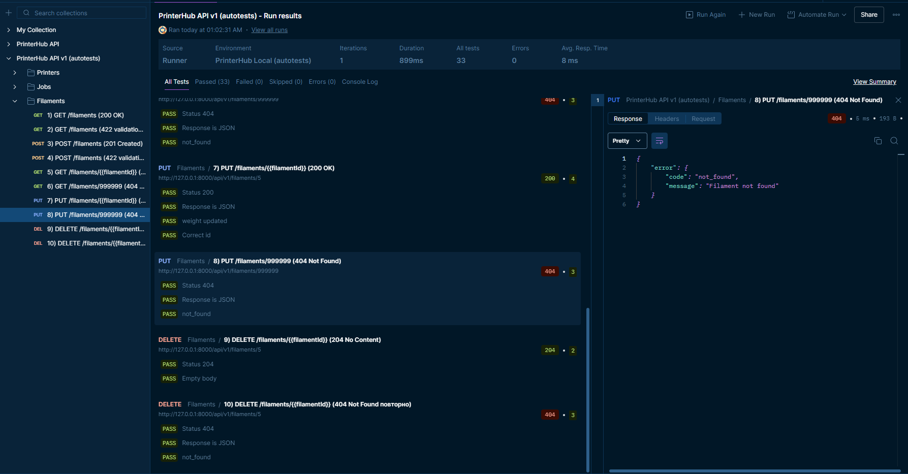

---

### **3.3.5. Удаление пластика: `DELETE` `/api/v1/filaments/{filament_id}`**

---

**Тест 1 (204)**  

- **Строка запроса:** `DELETE {{baseUrl}}/filaments/{{filamentId}}`
- **Скриншот запроса:**

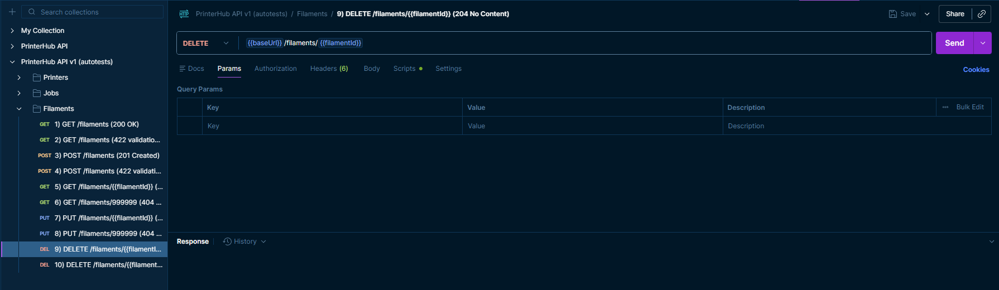

- **Скриншоты ответа:**

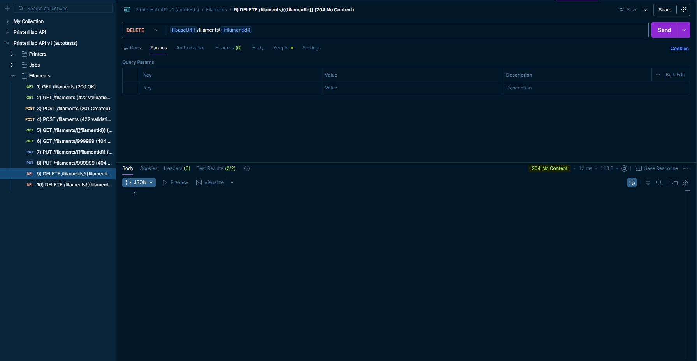

- **Код автотеста:**

```javascript
pm.test('Status 204', function () { pm.response.to.have.status(204); });
pm.test('Empty body', function () { pm.expect(pm.response.text()).to.eql(''); });
```

- **Скриншот Test Results:**

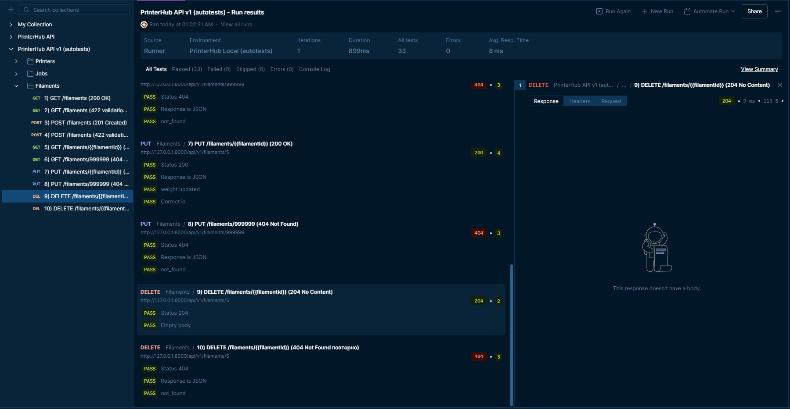

---

**Тест 2 (404)**  

- **Строка запроса:** `DELETE {{baseUrl}}/filaments/{{filamentId}}`
- **Скриншот запроса:**

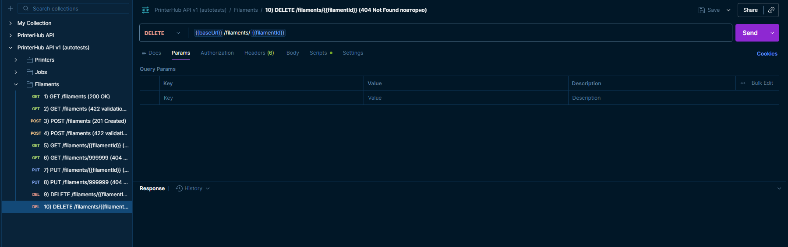

- **Скриншоты ответа:**

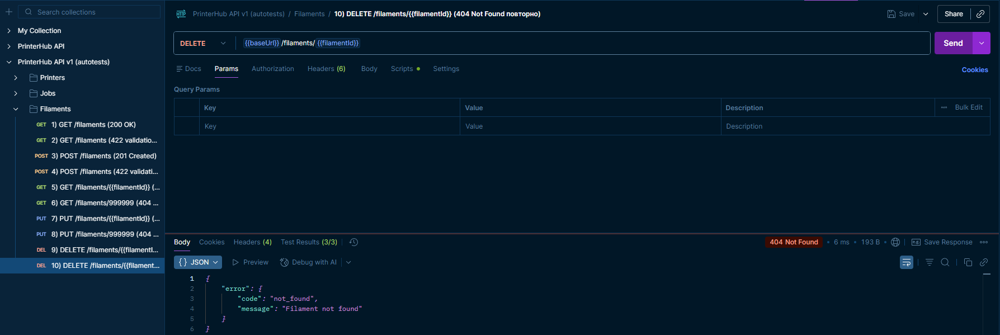

- **Код автотеста:**

```javascript
pm.test('Status 404', function () { pm.response.to.have.status(404); });
pm.test('Response is JSON', function () { pm.response.to.be.json; });
const data = pm.response.json();
pm.test('not_found', function () { pm.expect(data.error.code).to.eql('not_found'); });
```

- **Скриншот Test Results:**

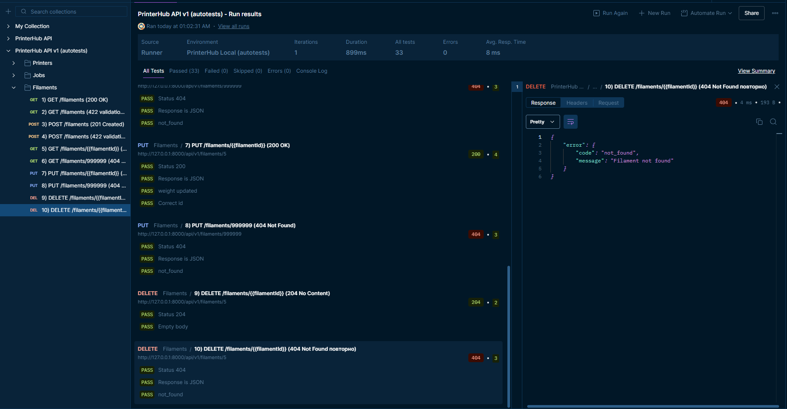

---
