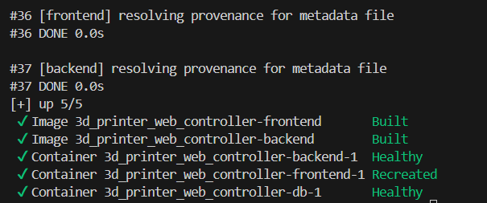
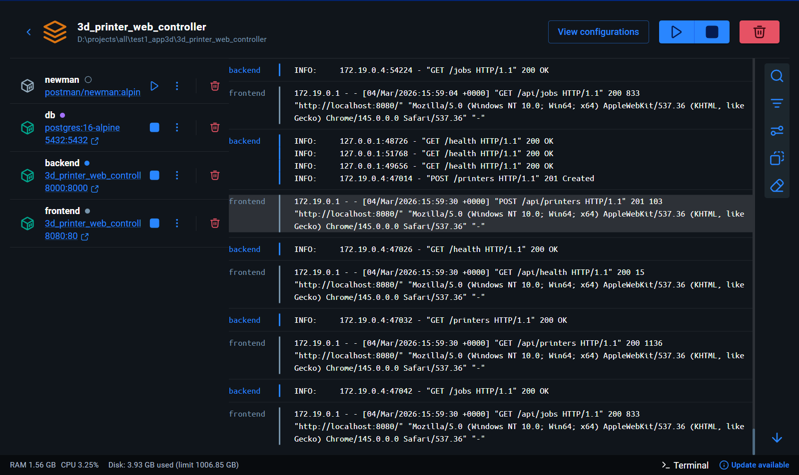
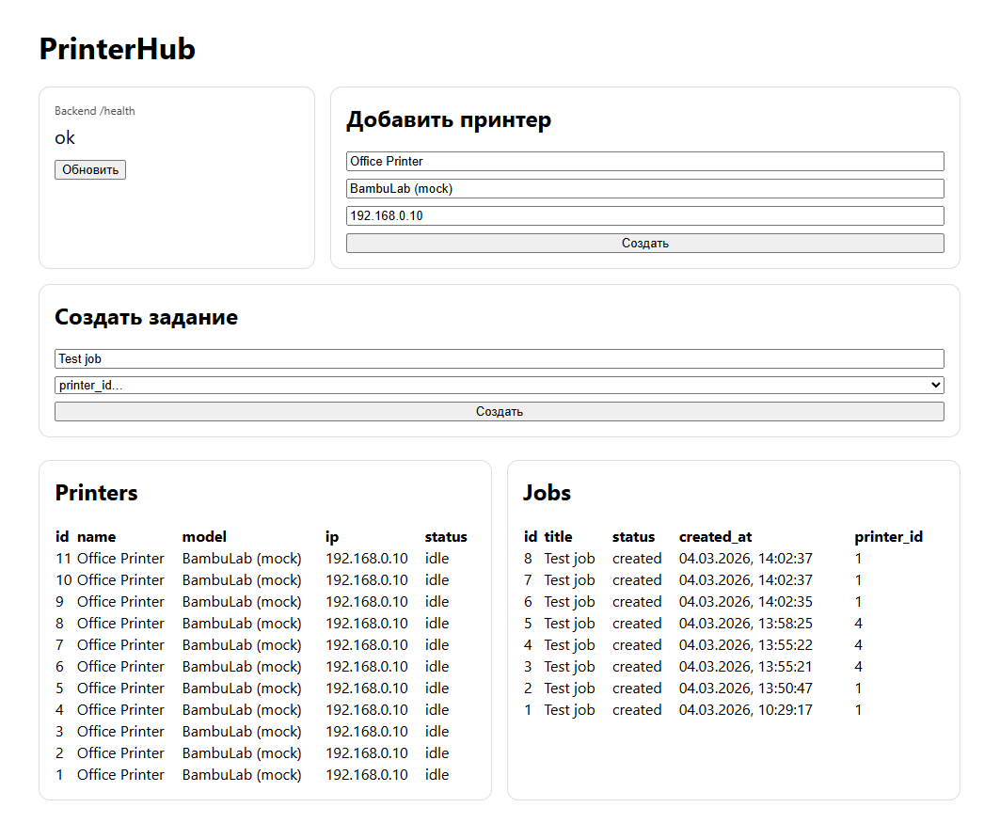
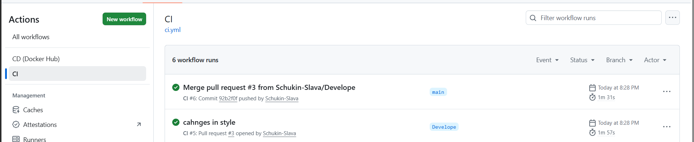
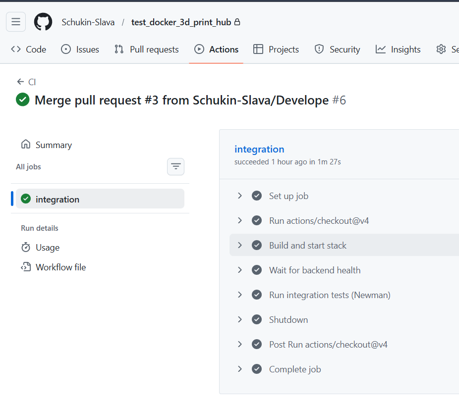
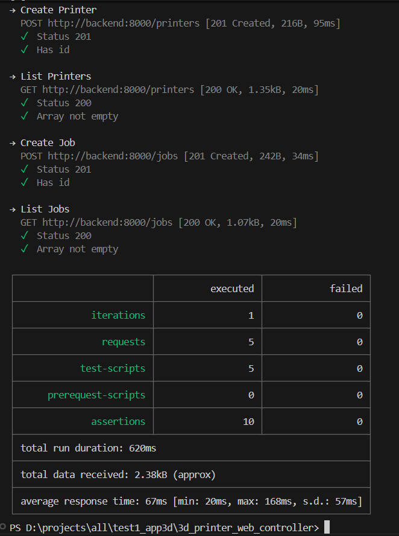
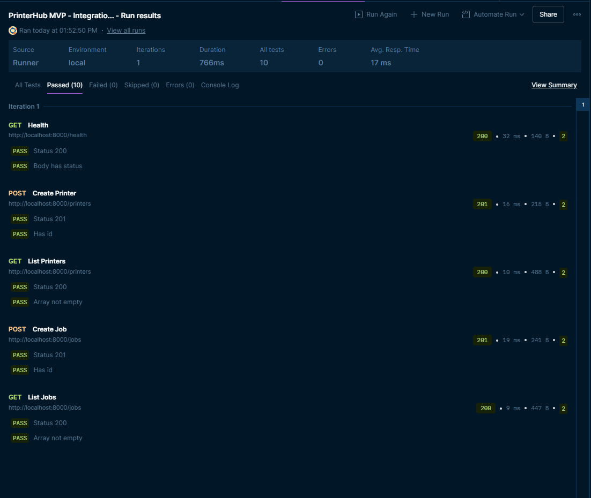
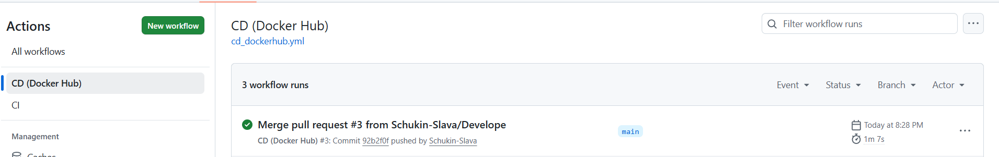
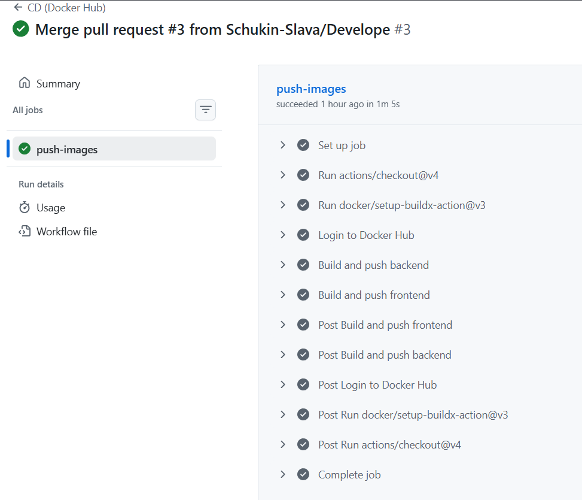
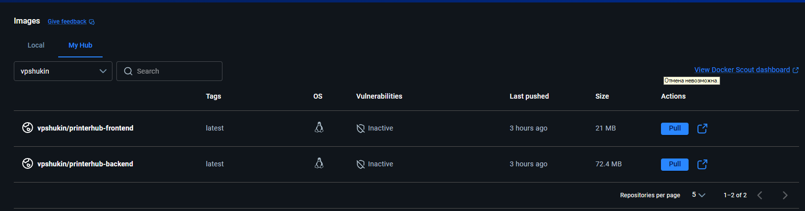

# Лабораторная работа №5

**Тема:** Реализация архитектуры на основе сервисов (микросервисной архитектуры).

**Цель работы:** Получить опыт работы организации взаимодействия сервисов с использованием контейнеров Docker.

**Ожидаемые результаты:**
1.	Согласно диаграмме контейнеров реализовать в отдельности каждый контейнер и настроить между ними взаимодействие. Выделить минимум 3 контейнера: клиентская часть, серверная часть и БД. Запустить контейнеры, показать работоспособность приложения, состоящего из взаимодействующих сервисов (запускать можно локально или на удаленной машине). (4 балла)
2.	Настроить непрерывную интеграцию (сборку приложения и создание docker-образов). (2 балла)
3.	Разработать интеграционные тесты и включить их в процесс непрерывной интеграции (можно подключить тесты, ранее созданные в Postman).(2 балла)
4.	Настроить непрерывное развертывание (развертывание реализовать можно публикацией образов на https://hub.docker.com/) (2 балла)

---

**Тема работы:**  "Разработка веб-приложения для удалённого мониторинга и управления парком 3D-принтеров"

---

# **1. Контейнеризация и взаимодействие сервисов (4 балла)**

## 1.1 Реализованные контейнеры

git репозиторий с проектом распологается по ссылке: https://github.com/Schukin-Slava/test_docker_3d_print_hub

Выделено 3 контейнера:
1. **frontend** — клиентская часть (React/Vite, сборка в статику, Nginx).  
2. **backend** — серверная часть (FastAPI + SQLAlchemy + Alembic миграции).  
3. **db** — база данных (PostgreSQL).  

Дополнительно:
- **newman** — сервис для прогона интеграционных тестов (Postman collection) внутри docker‑сети.

## 1.2 Взаимодействие сервисов

- **frontend → backend**: запросы из браузера идут на `http://localhost:8080`, а Nginx проксирует пути `/api/*` в backend.
- **backend → db**: backend подключается к Postgres по имени сервиса `db` внутри docker‑сети.
- Для надёжного старта используются **healthcheck** и `depends_on: condition: service_healthy`.

## 1.3 Запуск приложения локально

Из корня проекта:

```bash
docker compose up -d --build
docker compose ps
```

Открыть в браузере:
- Frontend: `http://localhost:8080`
- Backend (Swagger): `http://localhost:8000/docs`
- Health: `http://localhost:8000/health`

## 1.4 Модели данных

**Printer (принтер)**  
Поля:
- `id: int` — идентификатор (PK)
- `name: string` — название/ярлык принтера
- `model: string` — модель принтера (строка)
- `ip_address: string` — IP (в MVP хранится как данные)
- `status: string` — статус (по умолчанию `idle`)

**PrintJob (задание на печать)**  
Поля:
- `id: int` — идентификатор (PK)
- `title: string` — название задания
- `status: string` — статус (по умолчанию `created`)
- `created_at: datetime` — дата/время создания (UTC)
- `printer_id: int` — ссылка на принтер (FK)

## 1.5 Эндпоинты

| Назначение | Метод | Endpoint | Тело запроса | Ответ |
|---|---:|---|---|---|
| Проверка работоспособности | GET | `/health` | — | `{"status":"ok"}` |
| Создать принтер | POST | `/printers` | `PrinterCreate` | `PrinterOut` |
| Список принтеров | GET | `/printers` | — | `PrinterOut[]` |
| Принтер по id | GET | `/printers/{printer_id}` | — | `PrinterOut` |
| Создать задание | POST | `/jobs` | `JobCreate` | `JobOut` |
| Список заданий | GET | `/jobs` | — | `JobOut[]` |

---

## 1.6 Скриншоты работы

**docker compose up / состояние контейнеров:**


**Docker Desktop - список контейнеров и логи:**


**UI приложения:**



---

# **2. Непрерывная интеграция CI (2 балла)**

Для репозитория настроен **GitHub Actions** workflow `CI`, который запускается на `push` в `main` и на `pull_request`:

Что делает workflow:
1. Чекаут репозитория
2. Подъём стека: `docker compose up -d --build`
3. Ожидание готовности backend по `/health`
4. Запуск интеграционных тестов (Newman)
5. Остановка и удаление контейнеров/томов: `docker compose down -v`

Dockerfile для Backend:
```dockerfile
FROM python:3.13-slim
WORKDIR /app
ENV PYTHONDONTWRITEBYTECODE=1
ENV PYTHONUNBUFFERED=1
RUN pip install --no-cache-dir --upgrade pip
COPY requirements.txt /app/requirements.txt
RUN pip install --no-cache-dir -r /app/requirements.txt
COPY alembic.ini /app/alembic.ini
COPY alembic /app/alembic
COPY app /app/app
COPY start.sh /app/start.sh
RUN chmod +x /app/start.sh
EXPOSE 8000

CMD ["/app/start.sh"]
```

Docker Compose:
```yaml
services:
  db:
    image: postgres:16-alpine
    environment:
      POSTGRES_DB: printerhub
      POSTGRES_USER: printerhub
      POSTGRES_PASSWORD: printerhub
    ports:
      - "5432:5432"
    volumes:
      - pgdata:/var/lib/postgresql/data
    healthcheck:
      test: ["CMD-SHELL", "pg_isready -U printerhub -d printerhub"]
      interval: 5s
      timeout: 5s
      retries: 10

  backend:
    build:
      context: ./backend
    environment:
      DATABASE_URL: postgresql+psycopg://printerhub:printerhub@db:5432/printerhub
    ports:
      - "8000:8000"
    depends_on:
      db:
        condition: service_healthy
    healthcheck:
      test: ["CMD-SHELL", "python -c \"import urllib.request; urllib.request.urlopen('http://localhost:8000/health').read(); print('ok')\""]
      interval: 10s
      timeout: 5s
      retries: 10

  frontend:
    build:
      context: ./frontend
    ports:
      - "8080:80"
    depends_on:
      backend:
        condition: service_healthy

  newman:
    image: postman/newman:alpine
    depends_on:
      backend:
        condition: service_healthy
    volumes:
      - ./postman:/etc/newman
volumes:
  pgdata:
```

Скриншот успешного прогона workflow в GitHub Actions:



---

# **3. Интеграционные тесты и включение в CI (2 балла)**

## 3.1 Newman
**Newman** — это консольный запускатель (CLI) для **Postman‑коллекций**.  
Он позволяет прогонять те же тесты, что и в Postman UI, но автоматически (локально/в CI).

## 3.2 Содержимое тестов
Коллекция проверяет:
- `/health` возвращает `200` и `status=ok`
- создание принтера `/printers` (201, есть `id`)
- получение списка принтеров `/printers` (200, список не пустой)
- создание задания `/jobs` (201, есть `id`)
- получение списка заданий `/jobs` (200, список не пустой)

## 3.3 Запуск тестов локально

```bash
docker compose run --rm newman run /etc/newman/collection.json -e /etc/newman/env.json
```

Скриншот результата:


## 3.4 Запуск тестов в Postman
Коллекция импортируется в Postman.

Скриншот успешного прогона в Postman:


---


## 4. Непрерывное развертывание в Docker Hub (2 балла)

## 4.1 Развёртывание из Docker Hub

Настроен workflow **CD (Docker Hub)**, который при `push` в `main`:
1. логинится в Docker Hub через secrets (`DOCKERHUB_USERNAME`, `DOCKERHUB_TOKEN`)
2. собирает и публикует образы:
   - `<username>/printerhub-backend:latest`
   - `<username>/printerhub-frontend:latest`

Успешного выполнения:



Скриншот обновления репозитория:


## 4.2 Развёртывание из Docker Hub
Для развертывания без сборки из исходников используется файл `docker-compose.prod.yml`, где вместо `build:` указаны `image:` (образы из Docker Hub).

Запуск:
```bash
docker compose -f docker-compose.prod.yml up -d
```

Остановка:
```bash
docker compose -f docker-compose.prod.yml down -v
```

---