# Лабораторная работа №6

**Тема:** Использование шаблонов проектирования.

**Цель работы:** Получить опыт применения шаблонов проектирования при написании кода программной системы.

**Ожидаемые результаты:**

1.  (8 баллов) Применить типовые шаблоны проектирования GoF (Gang of Four) для своего проекта. Продемонстрировать результаты в виде конечного кода и UML-диаграмм:
    -	Порождающие шаблоны 3 шт.
    -	Структурные шаблоны 4 шт.
    -	Поведенческие шаблоны 5 шт.
2.  (2 балла) Проанализировать созданный код на наличие реализованных шаблонов GRASP. По необходимости реализовать:
    -	5 ролей (обязанностей) классов.
    -	3 принципа разработки.
    -	1 свойство программы.

---

**Тема работы:**  "Разработка веб-приложения для удалённого мониторинга и управления парком 3D-принтеров"

---

## Описание

В рамках лабораторной работы шаблоны проектирования подбираются для серверной части и связанных с ней интеграционных компонентов проекта. В качестве предметной области рассматриваются следующие сущности и процессы:

- Регистрация принтеров.
- Воздание и сопровождение заданий печати.
- Выбор драйвера или адаптера для конкретного типа принтера.
- Изменение состояний задания печати.
- Отправка уведомлений.
- Взаимодействие с объектным хранилищем, очередью задач и внешним API принтера.

---

# 1. Шаблоны проектирования GoF

## 1.1. Порождающие шаблоны

### 1.1.1 Одиночка (Singleton)

**Общее назначение.**  
Гарантирует наличие единственного экземпляра класса и предоставляет глобальную точку доступа к нему.

**Назначение в проекте.**  
Шаблон используется для объекта конфигурации приложения `SettingsRegistry`. Он хранит параметры подключения к БД, брокеру сообщений, объектному хранилищу и базовые настройки API. Это позволяет всем сервисам получать единый источник конфигурации без повторного создания объекта настроек.

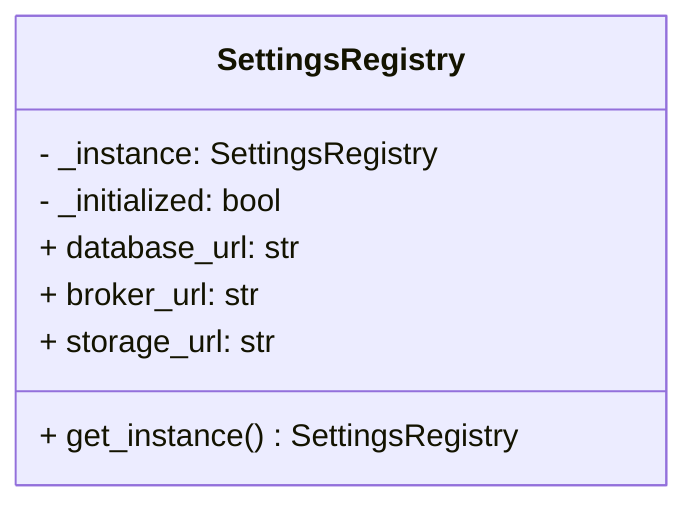

```python
# app/core/settings_registry.py
from __future__ import annotations

class SettingsRegistry:
    _instance: "SettingsRegistry | None" = None
    _initialized = False

    def __new__(cls) -> "SettingsRegistry":
        if cls._instance is None:
            cls._instance = super().__new__(cls)
        return cls._instance

    def __init__(self) -> None:
        if self.__class__._initialized:
            return

        self.database_url = "postgresql+psycopg://printerhub:printerhub@db:5432/printerhub"
        self.broker_url = "redis://broker:6379/0"
        self.storage_url = "http://minio:9000"
        self.__class__._initialized = True

    @classmethod
    def get_instance(cls) -> "SettingsRegistry":
        return cls()
```

---

### 1.1.2 Фабричный метод (Factory Method)

**Общее назначение.**  
Определяет интерфейс создания объектов, но оставляет подклассам или фабричному методу решение о том, какой конкретный класс создавать.

**Назначение в проекте.**  
Фабрика `PrinterGatewayFactory` выбирает нужный адаптер работы с принтером: `KlipperAdapter`, `MockPrinterAdapter`, в будущем — `MarlinAdapter`. Клиентский код не знает, какой драйвер создаётся, а работает только с интерфейсом `PrinterGateway`.

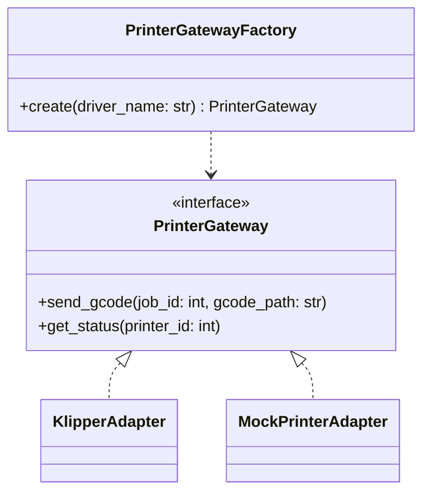

```python
# app/services/printers/factory.py
from abc import ABC, abstractmethod

class PrinterGateway(ABC):
    @abstractmethod
    def send_gcode(self, job_id: int, gcode_path: str) -> None: ...

    @abstractmethod
    def get_status(self, printer_id: int) -> str: ...

class KlipperAdapter(PrinterGateway):
    def send_gcode(self, job_id: int, gcode_path: str) -> None:
        print(f"[klipper] send {gcode_path} for job={job_id}")

    def get_status(self, printer_id: int) -> str:
        return "ready"

class MockPrinterAdapter(PrinterGateway):
    def send_gcode(self, job_id: int, gcode_path: str) -> None:
        print(f"[mock] emulate print for job={job_id}")

    def get_status(self, printer_id: int) -> str:
        return "idle"

class PrinterGatewayFactory:
    @staticmethod
    def create(driver_name: str) -> PrinterGateway:
        mapping = {
            "klipper": KlipperAdapter,
            "mock": MockPrinterAdapter,
        }
        gateway_cls = mapping.get(driver_name)
        if gateway_cls is None:
            raise ValueError(f"Unsupported driver: {driver_name}")
        return gateway_cls()
```

---

### 1.1.3 Строитель (Builder)

**Общее назначение.**  
Позволяет поэтапно конструировать сложный объект, отделяя процесс построения от его представления.

**Назначение в проекте.**  
В PrinterHub шаблон удобен для создания объекта задания печати. `PrintJobBuilder` пошагово добавляет идентификатор принтера, путь к модели, профиль печати, приоритет, статус и метаданные. Это снижает связанность эндпоинтов с внутренним устройством модели задания.

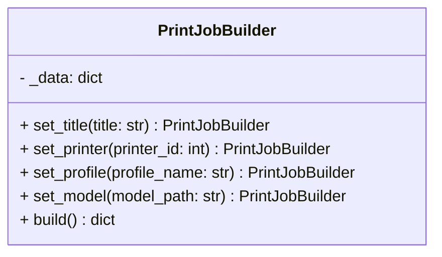

```python
# app/services/jobs/builder.py
from datetime import datetime

class PrintJobBuilder:
    def __init__(self) -> None:
        self._data = {
            "status": "created",
            "priority": "normal",
            "created_at": datetime.utcnow().isoformat(),
        }

    def set_title(self, title: str) -> "PrintJobBuilder":
        self._data["title"] = title
        return self

    def set_printer(self, printer_id: int) -> "PrintJobBuilder":
        self._data["printer_id"] = printer_id
        return self

    def set_profile(self, profile_name: str) -> "PrintJobBuilder":
        self._data["profile_name"] = profile_name
        return self

    def set_model(self, model_path: str) -> "PrintJobBuilder":
        self._data["model_path"] = model_path
        return self

    def build(self) -> dict:
        required = ("title", "printer_id", "profile_name", "model_path")
        missing = [key for key in required if key not in self._data]
        if missing:
            raise ValueError(f"Missing fields: {missing}")
        return dict(self._data)
```

---

## 1.2. Структурные шаблоны

### 1.2.1 Адаптер (Adapter)

**Общее назначение.**  
Преобразует интерфейс одного класса в другой интерфейс, который ожидает клиент.

**Назначение в проекте.**  
Используется `KlipperAdapter`, который скрывает особенности HTTP/WebSocket API принтера и предоставляет единый интерфейс `PrinterGateway`. Благодаря этому серверная часть не зависит от конкретной прошивки или протокола устройства.

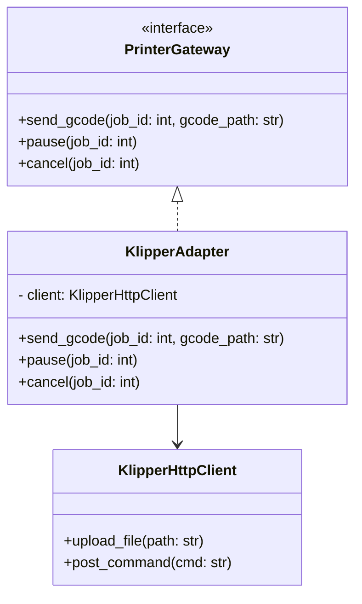

```python
# app/services/printers/klipper_adapter.py
class KlipperHttpClient:
    def upload_file(self, path: str) -> None:
        print(f"upload {path}")

    def post_command(self, cmd: str) -> None:
        print(f"execute {cmd}")

class KlipperAdapter(PrinterGateway):
    def __init__(self, client: KlipperHttpClient) -> None:
        self.client = client

    def send_gcode(self, job_id: int, gcode_path: str) -> None:
        self.client.upload_file(gcode_path)
        self.client.post_command(f"START_PRINT JOB_ID={job_id}")

    def pause(self, job_id: int) -> None:
        self.client.post_command(f"PAUSE JOB_ID={job_id}")

    def cancel(self, job_id: int) -> None:
        self.client.post_command(f"CANCEL_PRINT JOB_ID={job_id}")
```

---

### 1.2.2 Фасад (Facade)

**Общее назначение.**  
Предоставляет упрощённый интерфейс к сложной подсистеме.

**Назначение в проекте.**  
`PrintWorkflowFacade` объединяет несколько операций: создание задания, проверку принтера, выбор адаптера, публикацию события в очередь и сохранение записи в БД. Эндпоинты FastAPI работают только с фасадом, а не со всеми сервисами по отдельности.

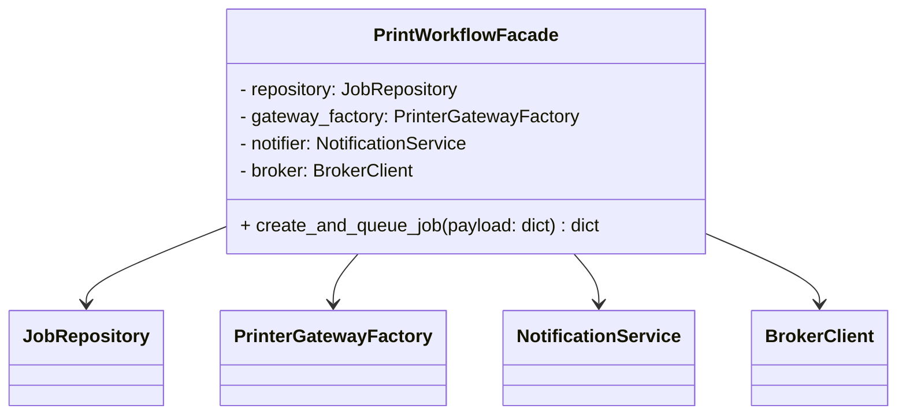

```python
# app/services/workflows/facade.py
class PrintWorkflowFacade:
    def __init__(self, repository, gateway_factory, notifier, broker) -> None:
        self.repository = repository
        self.gateway_factory = gateway_factory
        self.notifier = notifier
        self.broker = broker

    def create_and_queue_job(self, payload: dict) -> dict:
        job = self.repository.create_job(payload)
        gateway = self.gateway_factory.create(payload["driver"])
        status = gateway.get_status(payload["printer_id"])
        if status not in {"idle", "ready"}:
            raise RuntimeError("Printer is not ready")

        self.broker.publish("print_jobs", {"job_id": job["id"]})
        self.notifier.notify(f"Job {job['id']} queued")
        return job
```

---

### 1.2.3 Заместитель (Proxy)

**Общее назначение.**  
Предоставляет объект, который контролирует доступ к другому объекту с целью контроля доступа, кэширования или защиты.

**Назначение в проекте.**  
`SecurePrinterGatewayProxy` контролирует доступ к операциям принтера. Он проверяет права пользователя и только потом передаёт вызов настоящему `PrinterGateway`. Это полезно для команд остановки, паузы и повторного запуска задания.

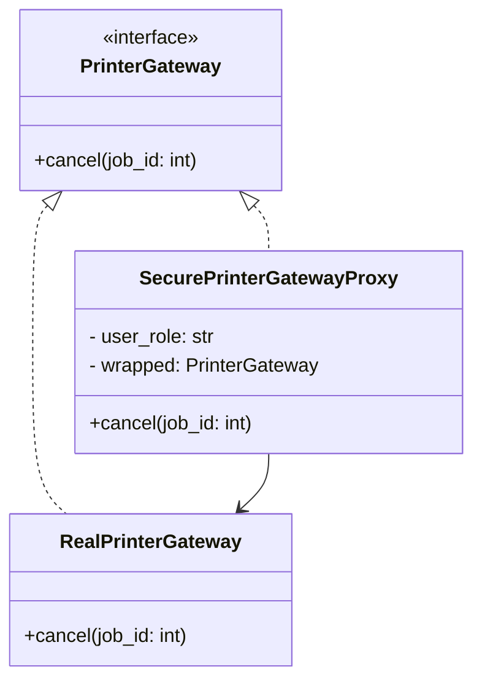

```python
# app/services/printers/proxy.py
class SecurePrinterGatewayProxy(PrinterGateway):
    def __init__(self, wrapped: PrinterGateway, user_role: str) -> None:
        self.wrapped = wrapped
        self.user_role = user_role

    def send_gcode(self, job_id: int, gcode_path: str) -> None:
        self.wrapped.send_gcode(job_id, gcode_path)

    def get_status(self, printer_id: int) -> str:
        return self.wrapped.get_status(printer_id)

    def cancel(self, job_id: int) -> None:
        if self.user_role not in {"admin", "technician"}:
            raise PermissionError("Only technician or admin can cancel a job")
        self.wrapped.cancel(job_id)
```

---

### 1.2.4 Декоратор (Decorator)

**Общее назначение.**  
Позволяет динамически добавлять объектам новые обязанности, не изменяя их класс.

**Назначение в проекте.**  
 Добавлять логирование, измерение времени и retry‑логику поверх адаптера принтера. `LoggingGatewayDecorator` не меняет базовый адаптер, а расширяет его поведение.

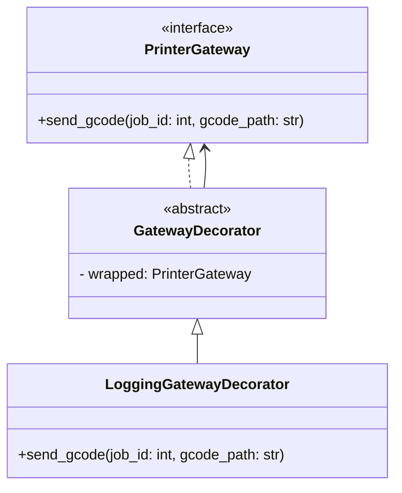

```python
# app/services/printers/decorators.py
import time

class GatewayDecorator(PrinterGateway):
    def __init__(self, wrapped: PrinterGateway) -> None:
        self.wrapped = wrapped

    def send_gcode(self, job_id: int, gcode_path: str) -> None:
        self.wrapped.send_gcode(job_id, gcode_path)

    def get_status(self, printer_id: int) -> str:
        return self.wrapped.get_status(printer_id)

class LoggingGatewayDecorator(GatewayDecorator):
    def send_gcode(self, job_id: int, gcode_path: str) -> None:
        started = time.perf_counter()
        print(f"[LOG] send_gcode started for job={job_id}")
        super().send_gcode(job_id, gcode_path)
        print(f"[LOG] finished in {time.perf_counter() - started:.3f}s")
```

---

## 1.3. Поведенческие шаблоны

### 1.3.1 Стратегия (Strategy)

**Общее назначение.**  
Определяет семейство алгоритмов, инкапсулирует каждый из них и делает их взаимозаменяемыми.

**Назначение в проекте.**  
Стратегия используется для выбора принтера под задание. Например, можно выбирать первый свободный принтер, принтер с минимальной очередью или принтер по приоритету материала. Эндпоинт или оркестратор знает только интерфейс стратегии.

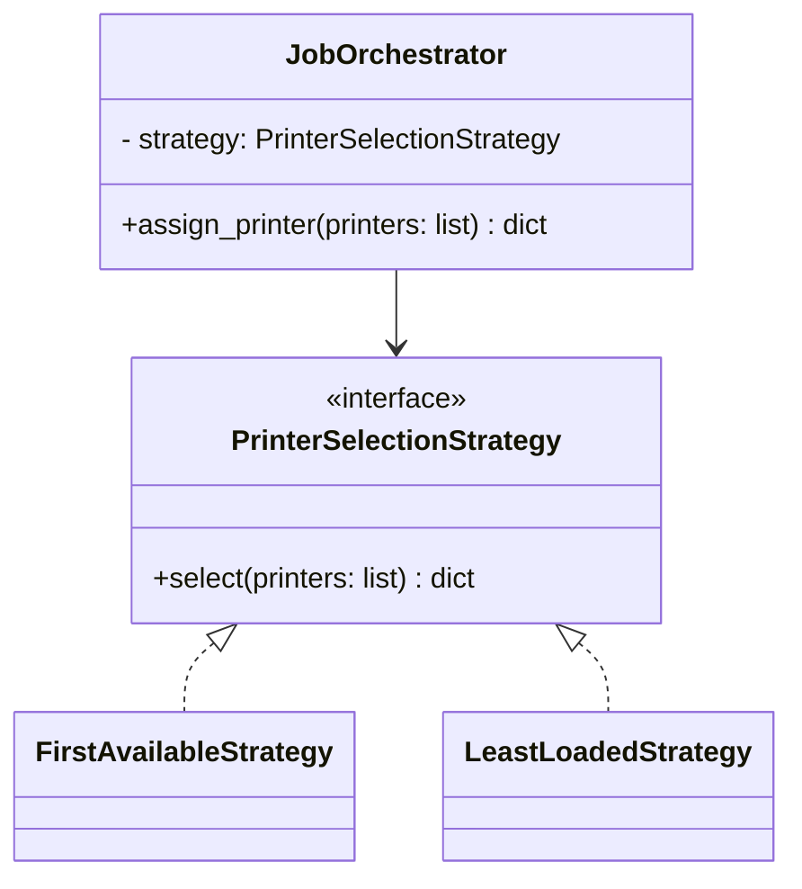

```python
# app/services/selection/strategy.py
from abc import ABC, abstractmethod

class PrinterSelectionStrategy(ABC):
    @abstractmethod
    def select(self, printers: list[dict]) -> dict: ...

class FirstAvailableStrategy(PrinterSelectionStrategy):
    def select(self, printers: list[dict]) -> dict:
        for printer in printers:
            if printer["status"] in {"idle", "ready"}:
                return printer
        raise RuntimeError("No available printers")

class LeastLoadedStrategy(PrinterSelectionStrategy):
    def select(self, printers: list[dict]) -> dict:
        return min(printers, key=lambda p: p.get("queue_size", 0))

class JobOrchestrator:
    def __init__(self, strategy: PrinterSelectionStrategy) -> None:
        self.strategy = strategy

    def assign_printer(self, printers: list[dict]) -> dict:
        return self.strategy.select(printers)
```

---

### 1.3.2 Состояние (State)

**Общее назначение.**  
Позволяет объекту изменять поведение при изменении своего внутреннего состояния.

**Назначение в проекте.**  
`PrintJobContext` хранит текущее состояние задания: `CreatedState`, `QueuedState`, `PrintingState`, `CompletedState`, `FailedState`. Это устраняет длинные цепочки `if/elif` при переходах между статусами.

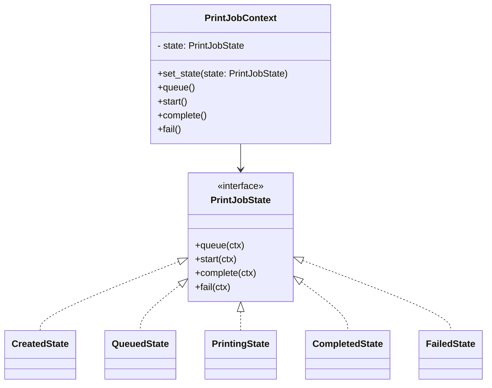

```python
# app/services/jobs/state.py
class PrintJobState:
    def queue(self, ctx): raise RuntimeError("Invalid transition")
    def start(self, ctx): raise RuntimeError("Invalid transition")
    def complete(self, ctx): raise RuntimeError("Invalid transition")
    def fail(self, ctx): raise RuntimeError("Invalid transition")

class CreatedState(PrintJobState):
    def queue(self, ctx):
        ctx.status = "queued"
        ctx.set_state(QueuedState())

class QueuedState(PrintJobState):
    def start(self, ctx):
        ctx.status = "printing"
        ctx.set_state(PrintingState())

class PrintingState(PrintJobState):
    def complete(self, ctx):
        ctx.status = "completed"
        ctx.set_state(CompletedState())

    def fail(self, ctx):
        ctx.status = "failed"
        ctx.set_state(FailedState())

class CompletedState(PrintJobState):
    pass

class FailedState(PrintJobState):
    pass

class PrintJobContext:
    def __init__(self) -> None:
        self.status = "created"
        self.state: PrintJobState = CreatedState()

    def set_state(self, state: PrintJobState) -> None:
        self.state = state

    def queue(self): self.state.queue(self)
    def start(self): self.state.start(self)
    def complete(self): self.state.complete(self)
    def fail(self): self.state.fail(self)
```

---

### 1.3.3 Команда (Command)

**Общее назначение.**  
Инкапсулирует запрос как объект, позволяя параметризовать клиентский код различными запросами, выстраивать очереди и хранить историю.

**Назначение в проекте.**  
Команды управления печатью (`StartPrintCommand`, `PausePrintCommand`, `CancelPrintCommand`) хорошо сочетаются с очередью задач и брокером сообщений. Оркестратор работает с объектами‑командами, а не с конкретными вызовами принтера.

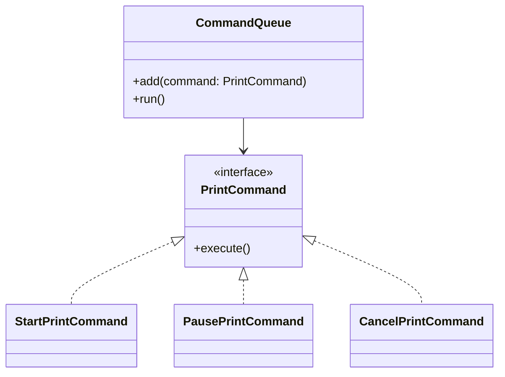

```python
# app/services/jobs/commands.py
from abc import ABC, abstractmethod

class PrintCommand(ABC):
    @abstractmethod
    def execute(self) -> None: ...

class StartPrintCommand(PrintCommand):
    def __init__(self, gateway: PrinterGateway, job_id: int, gcode_path: str) -> None:
        self.gateway = gateway
        self.job_id = job_id
        self.gcode_path = gcode_path

    def execute(self) -> None:
        self.gateway.send_gcode(self.job_id, self.gcode_path)

class CancelPrintCommand(PrintCommand):
    def __init__(self, gateway: PrinterGateway, job_id: int) -> None:
        self.gateway = gateway
        self.job_id = job_id

    def execute(self) -> None:
        self.gateway.cancel(self.job_id)

class CommandQueue:
    def __init__(self) -> None:
        self._commands: list[PrintCommand] = []

    def add(self, command: PrintCommand) -> None:
        self._commands.append(command)

    def run(self) -> None:
        while self._commands:
            self._commands.pop(0).execute()
```

---

### 1.3.4 Наблюдатель (Observer)

**Общее назначение.**  
Определяет зависимость «один ко многим» между объектами. При изменении состояния одного объекта все подписчики уведомляются автоматически.

**Назначение в проекте.**  
Изменение статуса задания должно одновременно попадать в WebSocket‑канал, в push‑уведомления и в журнал аудита. `JobStatusSubject` не знает конкретных реализаций наблюдателей и работает только с их интерфейсом.

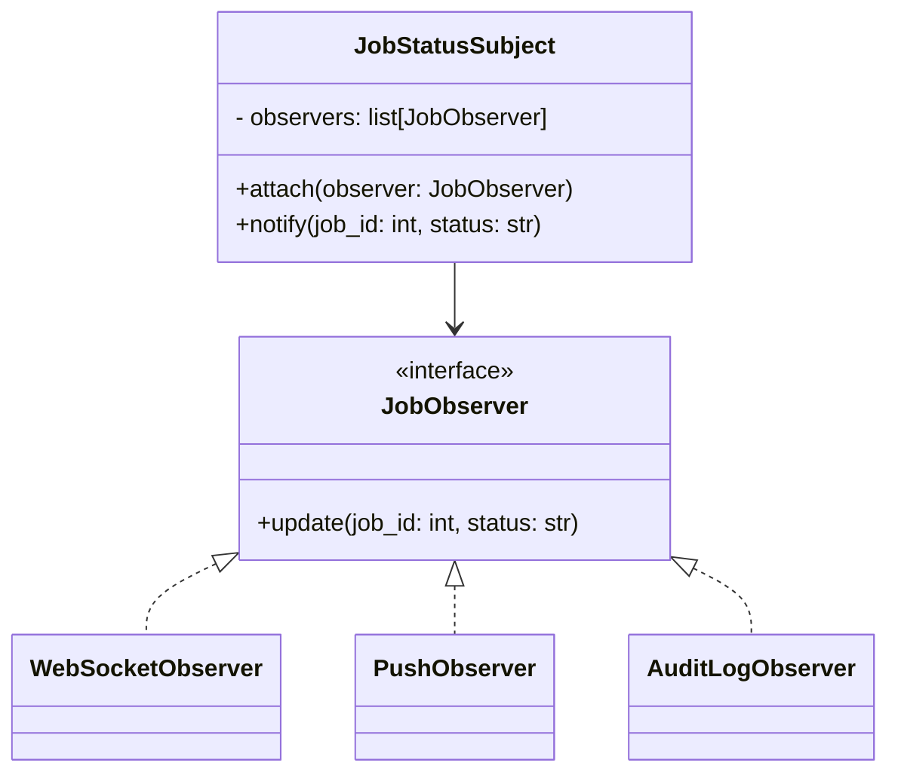

```python
# app/services/notifications/observer.py
from abc import ABC, abstractmethod

class JobObserver(ABC):
    @abstractmethod
    def update(self, job_id: int, status: str) -> None: ...

class WebSocketObserver(JobObserver):
    def update(self, job_id: int, status: str) -> None:
        print(f"[ws] job={job_id} status={status}")

class PushObserver(JobObserver):
    def update(self, job_id: int, status: str) -> None:
        print(f"[push] job={job_id} status={status}")

class AuditLogObserver(JobObserver):
    def update(self, job_id: int, status: str) -> None:
        print(f"[audit] job={job_id} -> {status}")

class JobStatusSubject:
    def __init__(self) -> None:
        self.observers: list[JobObserver] = []

    def attach(self, observer: JobObserver) -> None:
        self.observers.append(observer)

    def notify(self, job_id: int, status: str) -> None:
        for observer in self.observers:
            observer.update(job_id, status)
```

---

### 1.3.5 Шаблонный метод (Template Method)

**Общее назначение.**  
Определяет скелет алгоритма в базовом классе, оставляя подклассам возможность переопределять отдельные шаги.

**Назначение в проекте.**  
Общий алгоритм запуска печати можно зафиксировать в базовом процессе `BasePrintExecutionPipeline`: проверить модель, проверить материалы, подготовить данные, отправить на принтер и обновить статус. Для разных драйверов или сценариев меняются лишь отдельные шаги.

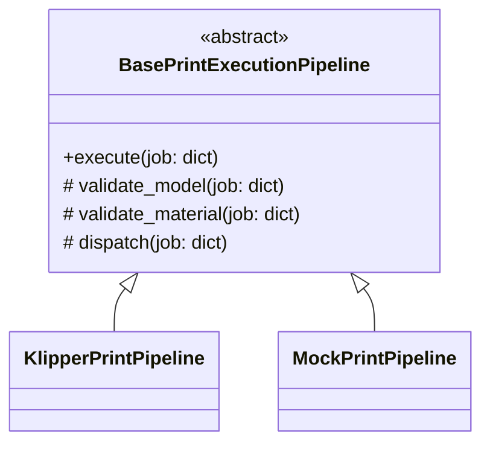

```python
# app/services/workflows/template_method.py
from abc import ABC, abstractmethod

class BasePrintExecutionPipeline(ABC):
    def execute(self, job: dict) -> None:
        self.validate_model(job)
        self.validate_material(job)
        self.dispatch(job)
        self.mark_started(job)

    def validate_model(self, job: dict) -> None:
        if not job.get("model_path", "").endswith(".3mf"):
            raise ValueError("Only .3mf models are supported")

    def validate_material(self, job: dict) -> None:
        if not job.get("filament_type"):
            raise ValueError("Filament is not specified")

    @abstractmethod
    def dispatch(self, job: dict) -> None: ...

    def mark_started(self, job: dict) -> None:
        job["status"] = "printing"

class KlipperPrintPipeline(BasePrintExecutionPipeline):
    def __init__(self, gateway: PrinterGateway) -> None:
        self.gateway = gateway

    def dispatch(self, job: dict) -> None:
        self.gateway.send_gcode(job["id"], job["gcode_path"])
```

---

# 2. Шаблоны проектирования GRASP

## 2.1. Роли (обязанности) классов

### 2.1.1 Создатель (Creator)

**Проблема.**  
Какой класс должен создавать экземпляры других классов?

**Решение.**  
Создание объекта следует поручать тому классу, который имеет для этого все необходимые данные или тесно связан с создаваемым объектом.

**Пример.**  
`PrinterGatewayFactory` создаёт нужный адаптер принтера, так как именно фабрика знает строковый идентификатор драйвера и сопоставление с конкретным классом.

```python
class PrinterGatewayFactory:
    @staticmethod
    def create(driver_name: str) -> PrinterGateway:
        mapping = {
            "klipper": KlipperAdapter,
            "mock": MockPrinterAdapter,
        }
        gateway_cls = mapping[driver_name]
        return gateway_cls()
```

**Результат.**  
Процесс создания объектов локализуется в одном месте и не дублируется в эндпоинтах и сервисах.

**Связь с другими паттернами.**  
Связан с GoF Factory Method и Builder.

---

### 2.1.2 Контроллер (Controller)

**Проблема.**  
Кто должен принимать внешние системные события и координировать выполнение сценария?

**Решение.**  
Следует выделить отдельный объект‑контроллер, который принимает запрос и делегирует бизнес‑логику специализированным объектам.

**Пример.**  
`RESTWebSocketController` в FastAPI принимает HTTP‑запросы и передаёт их фасаду рабочего процесса.

```python
from fastapi import APIRouter, Depends

router = APIRouter()

@router.post("/jobs", status_code=201)
def create_job(payload: dict, facade = Depends(get_print_workflow_facade)):
    return facade.create_and_queue_job(payload)
```

**Результат.**  
Отделяется слой представления от бизнес‑логики.

**Связь с другими паттернами.**  
Обычно использует Facade, Strategy, Command.

---

### 2.1.3 Информационный эксперт (Information Expert)

**Проблема.**  
Какому объекту поручить обязанность, если требуется использовать определённые данные?

**Решение.**  
Обязанность должна назначаться тому классу, который обладает нужной информацией.

**Пример.**  
`JobRepository` отвечает за создание и обновление заданий, так как именно он знает структуру таблиц, способ доступа к БД и правила сохранения.

```python
class JobRepository:
    def __init__(self, session):
        self.session = session

    def create_job(self, payload: dict) -> dict:
        job = PrintJob(**payload)
        self.session.add(job)
        self.session.commit()
        self.session.refresh(job)
        return {"id": job.id, "title": job.title, "printer_id": job.printer_id}
```

**Результат.**  
Упрощается распределение обязанностей и уменьшается дублирование логики доступа к данным.

**Связь с другими паттернами.**  
Связан с Repository/DB Adapter и Facade.

---

### 2.1.4 Слабая связанность (Low Coupling)

**Проблема.**  
Как уменьшить число жёстких зависимостей между классами?

**Решение.**  
Следует проектировать классы так, чтобы они зависели от абстракций, а не от конкретных реализаций.

**Пример.**  
`JobOrchestrator` зависит от интерфейса `PrinterSelectionStrategy`, а не от конкретной стратегии выбора принтера.

```python
class JobOrchestrator:
    def __init__(self, strategy: PrinterSelectionStrategy) -> None:
        self.strategy = strategy

    def assign_printer(self, printers: list[dict]) -> dict:
        return self.strategy.select(printers)
```

**Результат.**  
Система проще расширяется новыми алгоритмами и реализациями.

**Связь с другими паттернами.**  
Связан со Strategy, Observer, State и Adapter.

---

### 2.1.5 Высокая связность (High Cohesion)

**Проблема.**  
Как сделать класс более понятным и сфокусированным?

**Решение.**  
Следует оставлять в классе только тесно связанные обязанности.

**Пример.**  
`PrintWorkflowFacade` координирует исключительно сценарий создания и постановки задания в очередь. Он не занимается, например, SQL‑миграциями или логикой фронтенда.

```python
class PrintWorkflowFacade:
    def __init__(self, repository, gateway_factory, notifier, broker) -> None:
        self.repository = repository
        self.gateway_factory = gateway_factory
        self.notifier = notifier
        self.broker = broker
```

**Результат.**  
Код проще читать, сопровождать и тестировать.

**Связь с другими паттернами.**  
Фасад, Repository и Builder естественно опираются на high cohesion.

---

## 2.2. Принципы разработки

### 2.2.1 Посредник (Indirection)

**Проблема.**  
Как уменьшить прямую связанность между двумя объектами?

**Решение.**  
Вводится промежуточный объект, который координирует взаимодействие.

**Пример.**  
`NotificationService` или `JobStatusSubject` выступает посредником между ядром системы и конкретными уведомителями.

```python
class NotificationService:
    def __init__(self, subject: JobStatusSubject) -> None:
        self.subject = subject

    def notify_job_status(self, job_id: int, status: str) -> None:
        self.subject.notify(job_id, status)
```

**Результат.**  
Компоненты слабо знают друг о друге, систему проще менять.

**Связь с другими паттернами.**  
Связан с Observer, Facade, Proxy.

---

### 2.2.2 Полиморфизм (Polymorphism)

**Проблема.**  
Как единообразно работать с объектами разных типов?

**Решение.**  
Использовать общий интерфейс и полиморфные вызовы вместо цепочек `if/elif`.

**Пример.**  
Все драйверы принтера реализуют интерфейс `PrinterGateway`.

```python
def dispatch_job(gateway: PrinterGateway, job_id: int, gcode_path: str) -> None:
    gateway.send_gcode(job_id, gcode_path)
```

**Результат.**  
Добавление нового драйвера не требует переписывать код сценария печати.

**Связь с другими паттернами.**  
Adapter, Strategy, State, Template Method.

---

### 2.2.3 Устойчивость к изменениям (Protected Variations)

**Проблема.**  
Как защитить систему от изменений в нестабильных частях?

**Решение.**  
Нужно выделить стабильный интерфейс и скрыть за ним изменчивые реализации.

**Пример.**  
Интерфейс `PrinterGateway` защищает систему от изменений конкретных API принтеров.

```python
class PrinterGateway(ABC):
    @abstractmethod
    def send_gcode(self, job_id: int, gcode_path: str) -> None: ...

    @abstractmethod
    def get_status(self, printer_id: int) -> str: ...
```

**Результат.**  
Меняется реализация адаптера, но не код оркестратора и фасада.

**Связь с другими паттернами.**  
Factory Method, Adapter, Proxy, Decorator.

---

## 2.3. Свойство программы (цель)

### 2.3.1 Чистая выдумка (Pure Fabrication)

**Проблема.**  
Иногда ни один из реальных классов предметной области не подходит для новой обязанности без нарушения связности.

**Решение.**  
Создаётся вспомогательный класс, которого нет в предметной области, но который улучшает архитектуру.

**Пример.**  
`PrintWorkflowFacade`, `JobRepository`, `PrinterGatewayFactory` и `NotificationService` не являются реальными сущностями печати, но специально вводятся для разделения ответственностей.

```python
class NotificationService:
    def __init__(self, subject: JobStatusSubject) -> None:
        self.subject = subject

class JobRepository:
    def __init__(self, session):
        self.session = session
```

**Результат.**  
Уменьшается связность, улучшается тестируемость и читаемость системы.

**Связь с другими паттернами.**  
Facade, Factory Method, Observer, Repository, Adapter.

---
